# 프로필 베이스

### 직원 사진 관리용 백오피스 서비스

회사 내 직원들의 프로필 정보를 관리할 수 있습니다.  
사진, 한글이름, 영어이름, 팀, 이메일, 연락처, 관리자 여부 등을 설정할 수 있습니다.

[**서비스 바로가기**](https://profilebase-bm0729.web.app/main.html)

 
 

## 유저 플로우

현재까지는 단일 페이지 앱이라 페이지 별 유저 플로우를 보여주기 보단 기능들을 트리로 표현한 구조가 되었습니다.  
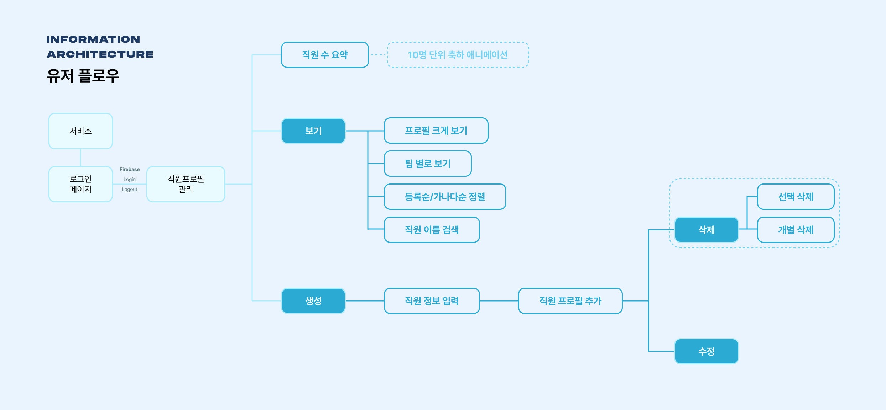

 
 

## 구현 사항

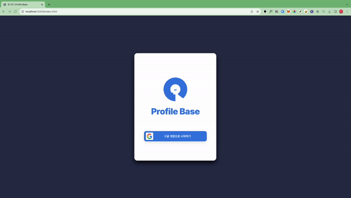
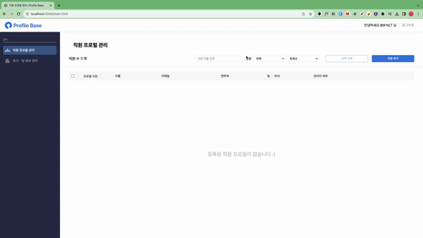

1. **구글 로그인 & 로그아웃 & 인사**

- 구글 아이디로 로그인할 수 있습니다.
- 메인 페이지에서도 우측 상단의 로그아웃으로 페이지를 벗어날 수 있습니다.
- 사용자의 닉네임을 파악하여 인사합니다.

 
 
 

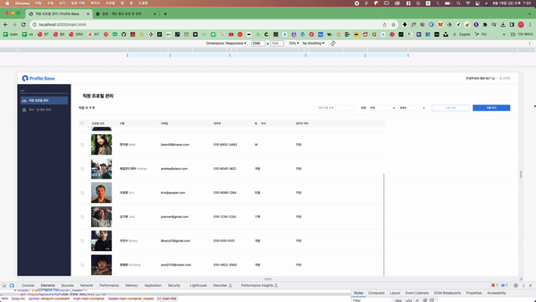

2. **반응형 디자인**

- 1440px 이상일 땐 모든 요소가 최대 크기로 출력됩니다.
- 391px ~ 1440px일 땐 좌측 사이드바가 collapse 되고 컬럼의 너비가 촘촘해집니다.
- 390px 이하일 땐 완전히 다른 모바일 뷰로 전환됩니다. 사이드바가 모바일 바텀 네비게이션으로 변합니다.
  - 생성 창도 팝업이 아닌 전체 페이지 크기로 전환됩니다.

 
 
 

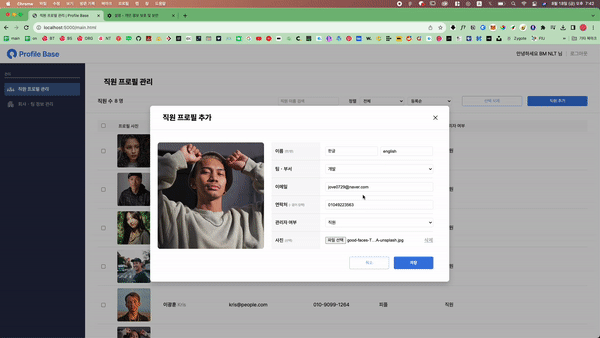

3. **프로필 생성하기**

- 사진을 업로드할 때 미리보기로 사진을 확인할 수 있습니다.
- 토스트 메시지

  - 프로필 생성 성공 시 토스트 메시지로 작업이 완료되었다고 알려줍니다.
  - 프로필 생성 실패 시 어떤 조건이 충족되지 않았는지 알려줍니다.

- 필수 입력값 입력 체크

  - 필수입력 요소(연락처, 이메일)를 입력했는지 체크합니다.

- 중복 체크

  - 이미 생성된 다른 프로필들의 연락처, 이메일과 겹치는지 체크합니다.

- 입력 유효성 평가
  - 잘못된 입력을 미리 방지합니다.
    - 한글이름 (한글 이외 다른 문자 제출 방지, 한글 1~6자)
    - 영어이름 (영어 이외 다른 문자 제출 방지, 영어 최대 12자)
      - 영어이름은 자동적으로 Pascal 케이스로 변환되어 프로필에 출력됩니다.
    - 연락처 형식 (숫자 9~10자)
      - 입력 시 '_'를 받지 않지만, 프로필에는 '_'로 구분되어 출력됩니다.
    - 이메일 형식 (yourID@example.example)
    - 이미지 파일은 3MB 이하인 경우만 업로드할 수 있습니다.

 
 
 

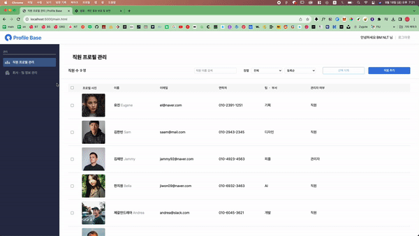

4. **이미지 미리보기**

- 프로필 사진에 마우스를 올릴 시 미리보기가 출력됩니다.

 
 
 

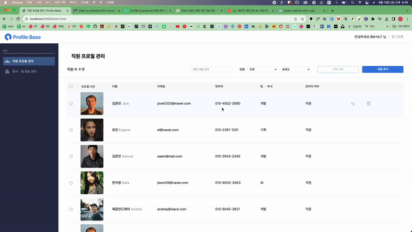

5. **프로필 수정하기**

- 프로필 요소에 마우스를 올릴 시 변경 버튼이 보입니다.
- 자신이 프로필 요소의 값을 수정할 수 있습니다.

 
 
 

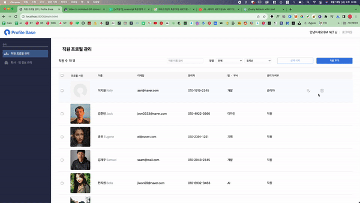

6. **프로필 삭제하기**

- 프로필 요소에 마우스를 올릴 시 삭제 버튼이 보입니다.
- 프로필을 삭제할 수 있습니다. (정말 삭제하시겠습니까? 물음에 응답해야 함)

 
 
 

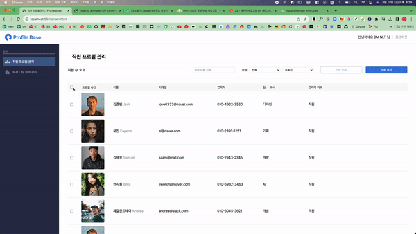

7. **여러 프로필을 모두 삭제하기**

- 체크박스로 여러 프로필을 선택하여 한꺼번에 삭제할 수 있습니다.
- 전체 선택 체크박스로 모두 선택할 수 있습니다.

 
 
 

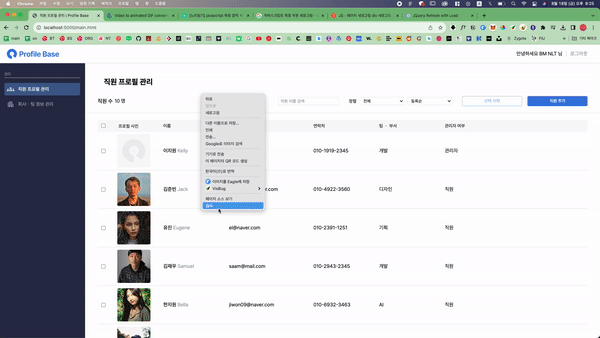

8. **로컬 스토리지로 서버 호출 간소화**

- 프로필 정보들은 로컬 스토리지에 저장되어 관리됩니다.
- 서버에서 데이터를 호출하기전에 먼저 로컬 스토리지를 통해서 데이터를 불러옵니다.
- 만약 사용자가 프로필 삭제 기능을 수행하지 않았는데 로컬 스토리지 데이터가 날라가는 상황이 생긴다면 파이어베이스 서버에서 데이터를 불러와 복원합니다. (사용자가 삭제 기능을 수행하지 않았으면 최대한 지켜줍니다.)

 
 
 

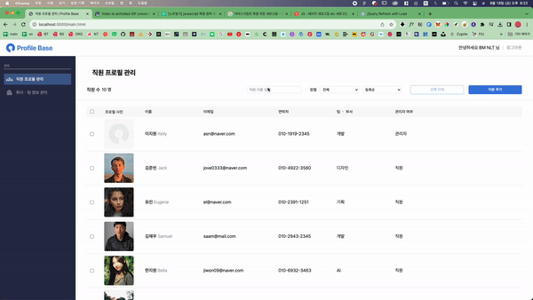

9. **직원 검색 기능**

- 직원들을 한글 이름 혹은 영어 이름으로 검색할 수 있습니다.

 
 
 

10. **팀 별 필터 기능**

- 사용자를 팀 별로 구분하여 볼 수 있습니다.
- 팀 조직도는 임의로 바꿀 수 없습니다. (팀 조직도에 변경이 필요하다면 개발자에게 문의하세요😄)

 
 
 

11. **등록순/가나다 순 정렬 기능**

- 등록된 순서 혹은 가나다 순으로 직원들을 추려볼 수 있습니다.

 
 
 

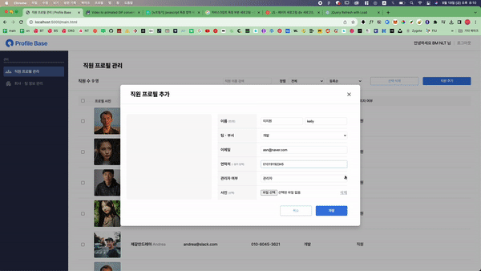

12. **10명 단위 마다 팡파레 애니메이션 표출**

- 와! 10명! 점점 더 커져가는 우리 회사를 축하하기 위해 10명 단위가 바뀔 때마다 팡파레를 울려요.

 
 
 
 

## 개발 태스크 (일정표)

- [x] 피그마 기획 및 디자인 8/9 - 8/10
  - ~~반응형 디자인 breakpoint: **390px**~~
  - ~~파이어베이스~~
    - ~~사진 관리~~
    - ~~로그인 기능 구현 - 구글 로그인?~~
  - 사진 편집기능
  - css em, rem수치 사용
  - ~~직원 등록 수정 삭제가 가능하게 하기~~
  - ~~로컬 스토리지와 파이어베이스 모두 사용? 로컬 스토리지에 저장으로 한 번 구현?~~
  - ~~로컬스토리지에 저장하고, 저장된 내용이 없으면 파이어베이스를 찾는 로직으로 하자.~~
- [x] 파이어베이스 활용(인강 학습) 8/11
  - 인강 학습의 결과: html/css를 일단 다 해준 다음에 JS를 구현하면 되겠다…
- [x] reset css연결
- [x] 색상 지정
- [x] html/ 로그인 페이지
- [x] css/ 로그인 페이지
- [x] css/ :root 지정
- [x] html/ 헤더 - common 8/12
- [x] css/ 헤더 - common 8/12
- [x] html 메뉴바 - common 8/12
- [x] css/ 메뉴바 - common 8/12
- [x] 메뉴바 현재 페이지에 포커스 - 그냥 html
- [x] html/ 리스트 부분 8/12
- [x] css/ 리스트 부분 8/12
- [x] html/ 직원 프로필 추가 페이지 8/12
- [x] css/ 직원 프로필 추가 페이지 8/12
- [x] html/ 직원 프로필 변경 페이지 8/12
- [x] css/ 직원 프로필 변경 페이지 8/12
- [x] 툴바 부분 width 줄여도 깨지지 않게 하기 (flex-shrink 0?)
- [x] 헤더 쉐도우 줘보기 - 8/13
- [x] 반응형 - 미디어쿼리 모바일- 8/13
  - [x] 1440px에서 sidebar break→ 아이콘형으로 바꾸기
  - [x] 375에서 모바일로 모두
- [x] 추가 버튼 누르면 팝업 나오게 하기 구현 - 8/13
  - [x] DIM도 구현 8/13
  - [x] 다른 곳을 누르면 꺼지기도 구현 8/13
- [x] 로컬 스토리지 저장 구현 - 8/13
- [x] 로컬 스토리지 불러오기 구현 - 8/13
- [x] 토스트 메시지 - 8/13
  - [x] 토스트메시지 html/css
  - [x] 에러와 성공 구분
  - [x] 표출 후 사라지기
- [x] 리스트에 프로필 생성한거 추가하기 8/14
- [x] 영어 이름 칸 추가하기…. 8/13
  - [x] css 수정
- [x] 추가 시와 수정 시에 팝업 헤더 텍스트 다르게 나오게 하기 - 8/13

- [x] 이메일 & 연락처 중복 처리 8/14
- [x] 변경 구현 8/14
- [x] 삭제 구현 8/14
- [x] 팝업 - 취소 버튼 구현 8/14

- [x] 리스트헤드 - 체크박스 - 전체 선택 기능 - 8/14
- [x] 전체 삭제 구현 8/14
- [x] 리스트가 비었을 때 “데이터가 없습니다.” 문구 나오게 하기
- [x] 리스트가 생겼을 때 “데이터 없습니다” 문구 숨기기
  - → ~~배열이 비었는지 아닌지로 판단해야될듯… 나중에 - 8/14~~
- [x] 직원 수 카운터 - 8/14
- [x] 고유 정보여야 하는거 체크하기 8/14
  - [x] 이메일
  - [x] 연락처
- [x] 메뉴/헤더 부분 드래그 막기

- 로컬스토리지에 이미지는 저장 x
- [x] 파이어베이스 로그인 구현 - 8/16
- [x] 파이어베이스 로그아웃 구현 - 8/16
- [x] 파이어베이스 storage 저장 구현 - 8/16
- [x] 파이어베이스 storage 불러오기 구현 - 8/16
- [x] 파이어베이스 storage 삭제 구현 - 8/16
- [x] 파이어베이스 storage 전체 삭제 구현 - 8/16
- [x] 로그인하면 헤더 우측 상단 인사에 이름 표출 - 8/16
- [x] 로컬스토리지에 저장하고, 저장된 내용이 없으면 파이어베이스를 찾는 로직 구현 - 8/16
- [x] 프로필 사진 업데이트 만들기 8/16

  - [x] 파일 업로드 8/16
  - [x] 파일 로드… 8/16
  - [x] 파일 제한 8/16

  - [x] 사진 용량 제한 8/17
  - [x] 사진 삭제 8/17
  - [x] 생성시 불러오기는 2초의 지연시간, 그냥 불러오기는 지연시간 없이
  - [x] 프로필 영역 빈거 이쁘게 바꾸기(사진 불러오기 부분의 else문으로 가능할듯 img.src….) 8/17

- [x] 업로드 시 사진 미리보기 8/17
- [x] 팝업 끄면 이미지 미리보기 했던 것도 지워지게 하기 8/17
- [x] 수정할 때 사진 또 보이게 하기 8/17
- [x] 프로필에 커서 올려놓으면 크게 보기 창 나오기 - 8/17
  - [x] 미디어 쿼리 신경쓰기
- [x] 이메일 형식 검증 8/17
- [x] 연락처 검증 8/17
- [x] 영어이름 입력 안 했을 땐 검증 피하게 만들기
- [x] 연락처 ‘-’들어가게 생성하게 만들기 8/17
- [x] 구글 로그인 아이콘 형식 맞춤
- [x] 직원 검색기능 8/17 목
  - 계획:
    - 해당 input text의 alue변화 이벤트를 탐지
    - (이름에) 해당 문자(alue)가 포함되어있는 녀석들만 no none 나머지는 모두 none
    - 검색창에 아무 문자가 없으면 모두 no none
- [x] 팀 필터 정렬 기능 8/17
  - 셀렉트 값 alue외엔 모두 none
- [x] 등록순 / 가나다순 정렬 기능 8/17
  - 등록순: 그냥 다시 로드
  - 이름 순 (얕은 복사) employeeArr.slice().sort(()⇒ {이름 가나다순 로직…})
- [x] 입력값 글자수 제한? 8/17
  - 한글이름 6자
  - 영어이름 12자
  - 말줄임표…? 글자제한과 너비 조절로 해결
- ~~html/css 인풋 아래 입력값에 따른 힌트문구 만들까..? ㄴㄴ label에 그냥 써놓자.. 백오피스니깐 ~~
- [x] ~~수정 시 사진 날라가는 버그 수정~~ 8/17
- [x] 팀 변경 안 되는 버그 수정 8/17
- [x] 이미지 수정 시 새로고침을 해야지만 제대로 보이는거 수정… (80%) 8/17
- [x] 로컬스토리지를 다 삭제해버리면 파이어베이스 서버에서 가져온 스트링값들은 정상인데 이미지파일만 못불러옴 ⇒ 버그 수정 8/17
- [x] 수정 시에는 자기 자신의 연락처, 이메일이면 중복값 면제시켜주기 (ID 대조) 8/17
- [x] 수정/삭제 버튼에 약한 transition 등장 애니메이션 주기
- [x] css em, rem수치 사용(4px의 배수로 나눠지는 길이만...)
- [x] 10명 단위마다 팡파레 울리기
- [x] netlify 혹은 firebase 배포하기 8/18
- [x] readme 정리하기 8/18
