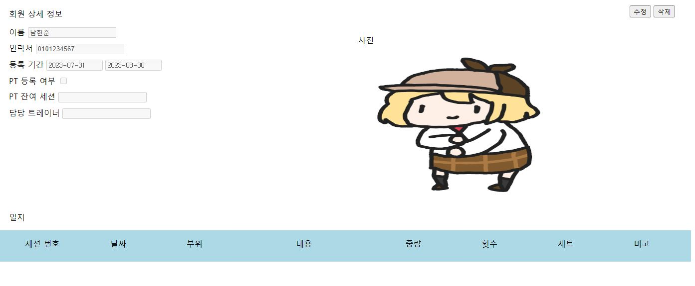
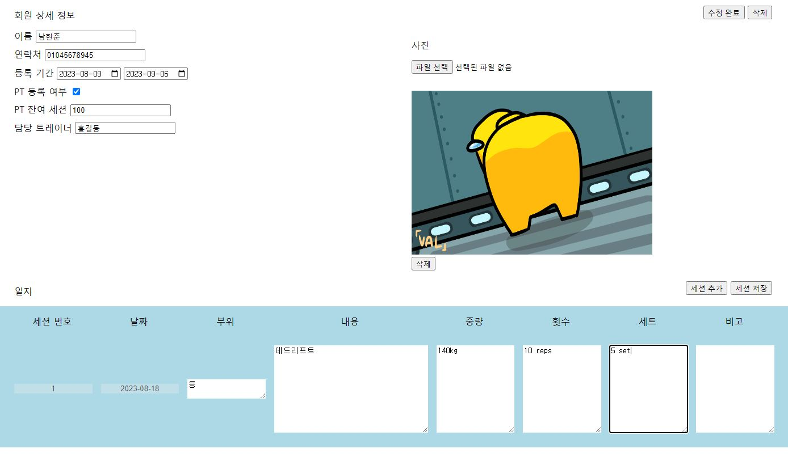

# :weight_lifting_man: 헬스장 회원 관리 서비스

직원들의 사진을 관리할 수 있는 사진 관리자 서비스를 만들어 보세요.

## 배포 주소
https://velvety-puppy-c1029b.netlify.app/

## [필수 요구사항]
- [X] “AWS S3 / Firebase 같은 서비스”를 이용하여 사진을 관리할 수 있는 페이지를 구현하세요.
- [X] 프로필 페이지를 개발하세요.
- [X] 스크롤이 가능한 형태의 리스팅 페이지를 개발하세요.
- [X] 전체 페이지 데스크탑-모바일 반응형 페이지를 개발하세요.
- [X] 사진을 등록, 수정, 삭제가 가능해야 합니다.
- [X] 유저 플로우를 제작하여 리드미에 추가하세요.
- CSS
  - [X] 애니메이션 구현
  - [X] 상대수치 사용(rem, em)
- JavaScript
  - [X] DOM event 조작

## [선택 요구사항]
- 사진 관리 페이지와 관련된 기타 기능도 고려해 보세요.
- 페이지가 보여지기 전에 로딩 애니메이션이 보이도록 만들어보세요.
- [X] 직원을 등록, 수정, 삭제가 가능하게 해보세요.
- infinity scroll 기능을 추가해 보세요.

## 유저 플로우

## 화면 예시
### 메인 페이지

- 회원 전체 정보 열람이 가능한 메인 페이지입니다.
- 좌측 상단의 등록 버튼을 통해 회원 신규 등록이 가능하고, 체크박스로 회원을 선택한 후 삭제할 수 있습니다.
- 회원 목록 영역 내에서 회원 번호를 선택해, 해당 회원의 프로필 페이지로 이동할 수 있습니다.

### 등록 페이지

- 회원 정보와, 사진 등록이 가능합니다.
- 삭제 버튼을 통해, 등록한 사진을 삭제할 수 있습니다.
- 회원 정보와 사진 등록을 완료한 뒤, 우측 상단의 등록 버튼을 통해 메인 페이지로 이동할 수 있습니다.

### 프로필 페이지

- 등록한 회원의 정보를 열람할 수 있습니다.
- 등록된 정보는 수정할 수 없으며, 회원 정보 수정이 필요한 경우 우측 상단의 수정 버튼을 통해 수정 페이지로 진입합니다.

### 수정 페이지

- 등록한 회원의 정보를 수정할 수 있습니다.
- 사진 하단의 삭제 버튼을 눌러 기존 등록된 사진을 삭제하고, 새로운 사진을 등록시킬 수 있습니다.
- 하단의 일지 영역 내에서 세션 추가 버튼을 통해 내용을 입력하고, 세션 저장 버튼을 통해 내용을 저장할 수 있습니다.

## 느낀 점

필수 기능을 먼저 빠르게 완성시켜 놓은 다음 이후 기능 구현을 진행했어야 했는데, 처음부터 기획을 너무 크게 잡고 진행해 속도도 나지 않았고, 목표로 한 기능들도 전부 구현하지 못해 스크립트 부분만 빠르게 진행하였고, css 스타일링 부분은 많이 진행하지 못했던 점이 아쉬웠습니다.

현재 필수 기능 중 데스크탑-모바일 반응형 개발 부분은 미구현 상태입니다.
추후 리팩토링 진행하면서 구현 예정입니다.
