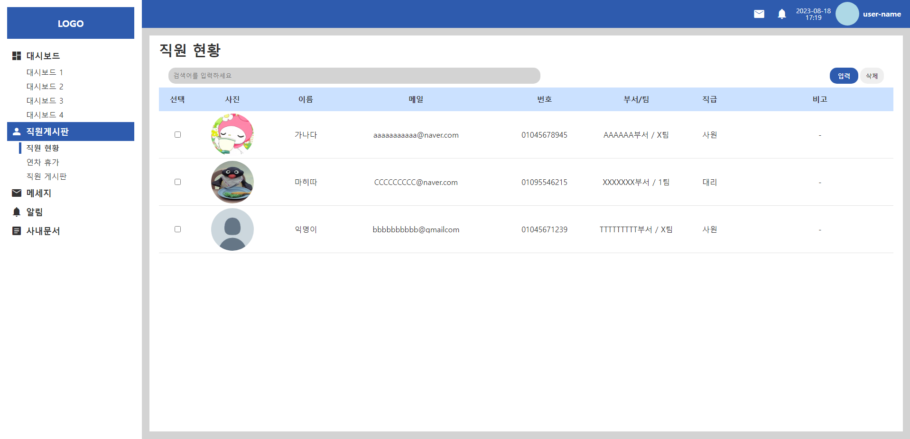
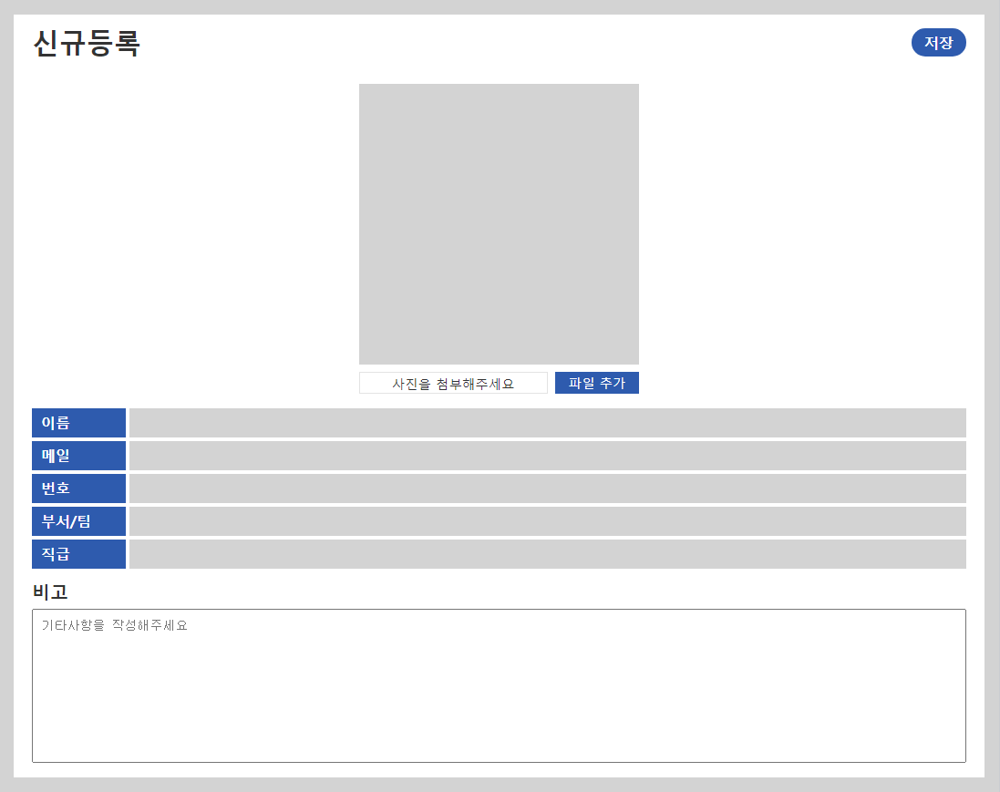
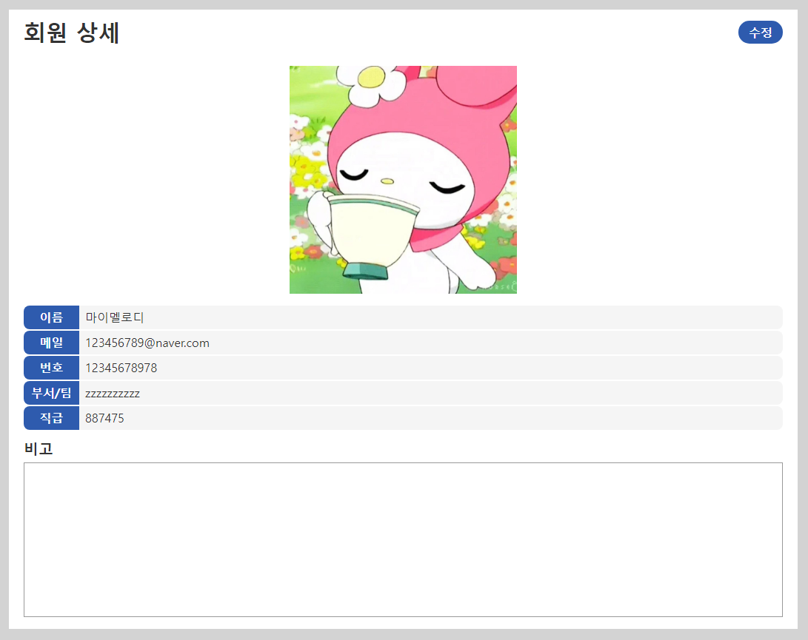
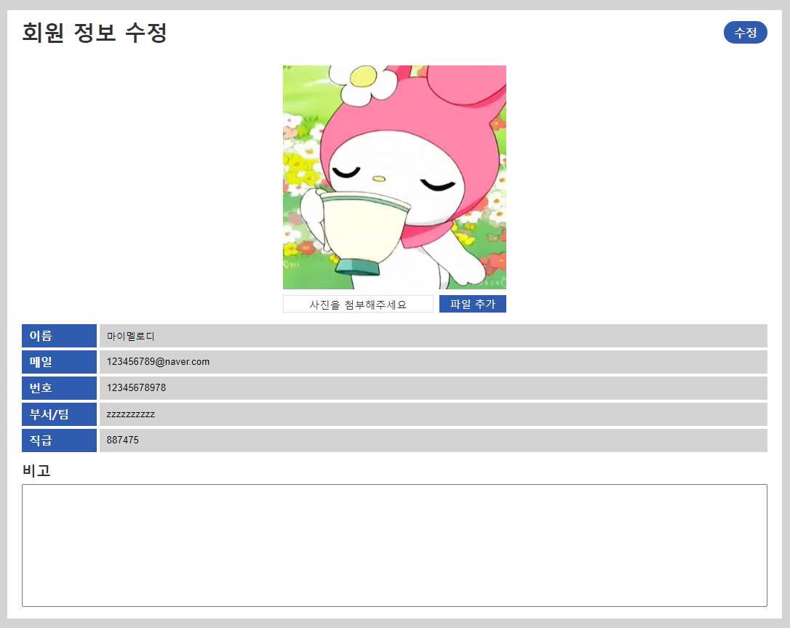
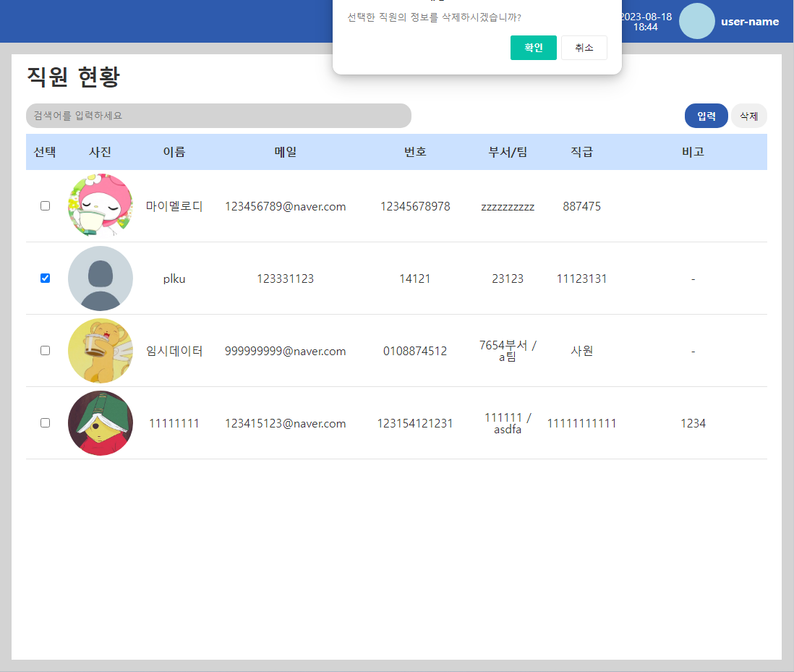
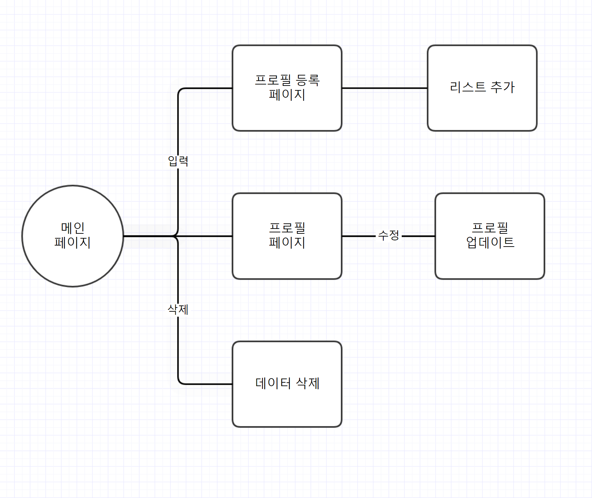

# 사진 관리 페이지 과제

> firebase를 이용해 직원들의 사진을 관리 할 수 있는 admin 페이지 제작

파이어베이스를 이용해 직원들의 데이터 및 이미지를 저장, 수정, 삭제 가능한 리스트 페이지 제작

## 사용 예제

- 전체적인 페이지 흐름 입니다.
  

<h3>Create</h3>

- 이미지, 이름, 메일, 전화번호, 부서, 직급 등의 사항을 넣을 수 있음
- 빈 데이터가 있을 경우 alert 창을 띄워서 모든 데이터를 넣어야 함

<h3>Read</h3>

- 생성한 리스트가 표시되는 페이지

<h3>Update</h3>

- 수정 버튼을 누르면 기존의 데이터를 덮어씌울 수 있음

<h3>Delete</h3>

- checkbox를 이용해 한번에 여러가지 리스트도 삭제 가능
- 선택한 리스트 없이 누를 경우 '삭제할 직원을 선택하세요' alert 표시

## 업데이트 내역

- 0.1.0
  - 첫 푸시
- 0.0.1
  - 작업 진행 중

## 유저 플로우

