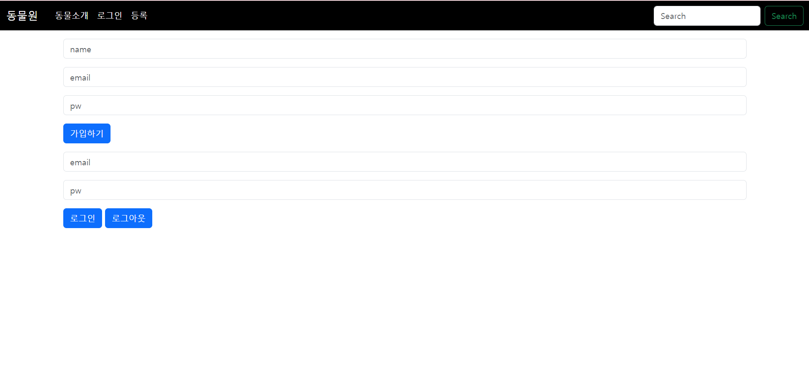
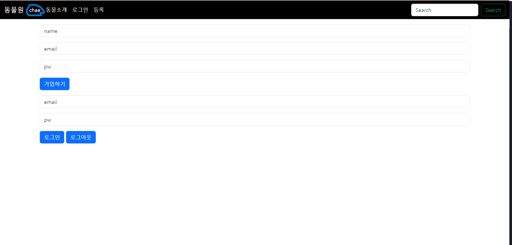
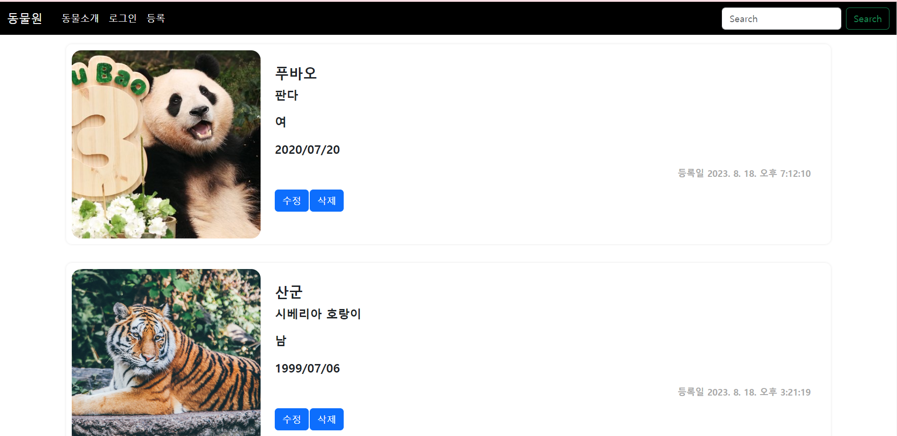
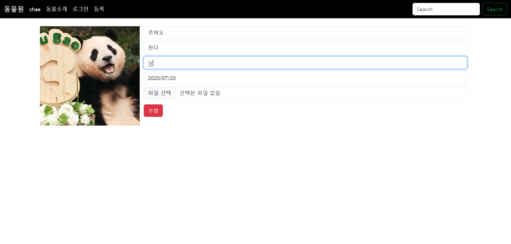
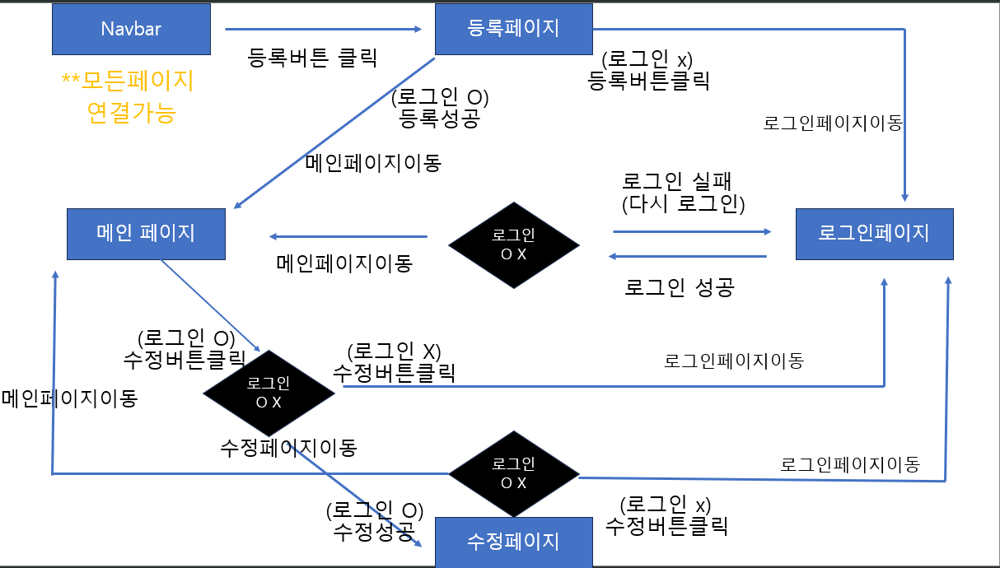

# 동물원 동물 등록 서비스

### url:[https://third-bb997.web.app/index.html](https://third-bb997.web.app/index.html)

동물원에서 동물들의 정보,사진 등을 등록, 수정, 삭제 할 수 있는 서비스를 만들었습니다.
등록,수정,삭제 기능은 로그인 상태일 때 가능하도록 설정 하였습니다.

기술 스택:

## [페이지 소개]

### 로그인 페이지

-   가입 및 로그인, 로그아웃 기능이 있습니다.
-   로그인이 성공적으로 완료되면 로그인상태일 때 navbar에 가입시 작성한 name이 로그아웃 전까지 나타납니다.

-   로그인전
    

-   로그인후 (navbar에 이름이 나타납니다)
    

### 등록 페이지

-   동물들의 정보 및 사진을 등록하기 버튼을 통해 등록합니다
    

### 메인 페이지(동물소개)

-   등록된 동물들의 이미지나 정보들을 볼 수 있습니다.
-   수정 및 삭제버튼을 통해 수정페이지로 이동 게시물 삭제 등을 진행할 수 있습니다.
    

### 수정페이지

-   각 동물별 정보 및 사진을 수정할 수 있는 페이지로 수정 후 수정 버튼을 클릭하면 수정된 메인페이지에 수정되어 나타납니다.
    

## [필수 요구사항]

-   [x] “AWS S3 / Firebase 같은 서비스”를 이용하여 사진을 관리할 수 있는 페이지를 구현하세요.
-   [x] 프로필 페이지를 개발하세요.
-   [x] 스크롤이 가능한 형태의 리스팅 페이지를 개발하세요.
-   [x] 전체 페이지 데스크탑-모바일 반응형 페이지를 개발하세요.
-   [x] 사진을 등록, 수정, 삭제가 가능해야 합니다.
-   [x] 유저 플로우를 제작하여 리드미에 추가하세요.
-   [] CSS 애니메이션 구현
-   [x] CSS 상대수치 사용(rem, em)
-   [x] JavaScript Dom Event 조작

## [User flow]

