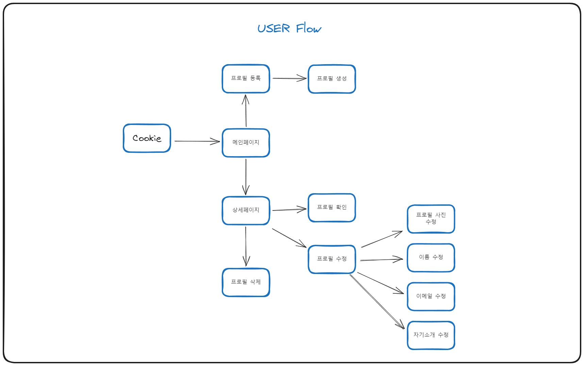

## 캐릭터 사진을 관리할 수 있는 서비스

- 배포 : https://member-65170.web.app/

## User-flow

## [구현 화면 미리보기]

### 첫 화면(이미지를 클릭하면 리스트로 이동)

### 리스트 페이지(데이터가 없을 경우)

### 생성 페이지(사진등록과 모든 데이터가 입력되어야 함)

### 생성 페이지 - 로딩스피너추가

### 리스트 페이지(데이터가 있는 경우)

### 상세 페이지(리스트에서 해당 캐릭터 사진을 누르면 이동)

### 정보 수정 페이지

### 삭제 기능

### 검색 기능

### 반응형 페이지

## [필수 요구사항]

- “AWS S3 / Firebase 같은 서비스”를 이용하여 사진을 관리할 수 있는 페이지를 구현하세요. (o)
- 프로필 페이지를 개발하세요.(o)
- 스크롤이 가능한 형태의 리스팅 페이지를 개발하세요. (o)
- 전체 페이지 데스크탑-모바일 반응형 페이지를 개발하세요.(o)
- 사진을 등록, 수정, 삭제가 가능해야 합니다.(o)
- 유저 플로우를 제작하여 리드미에 추가하세요.(o)

* CSS - 애니메이션 구현, 상대수치 사용 (o)
* JavaScript - DOM event 조작(o)

## [선택 요구사항]

- 페이지가 보여지기 전에 로딩 애니메이션이 보이도록 만들어보세요.(o)
- 직원을 등록, 수정, 삭제가 가능하게 해보세요.(o)
- 직원 검색 기능을 추가해 보세요.(o)

## [구현한 내용]

- html, js, css를 이용한 사진 관리 페이지
- 필수 요구사항들과, 위에 언급한 선택 요구사항
- firestore을 이용한 데이터, 사진 저장과 배포
