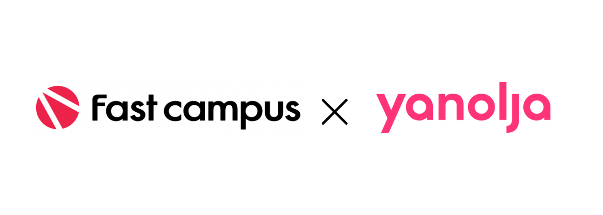
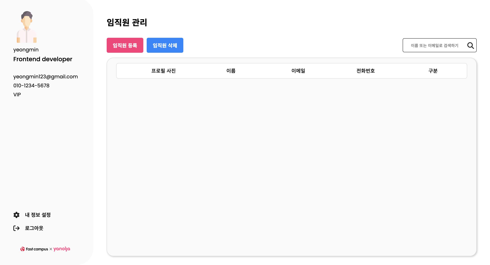
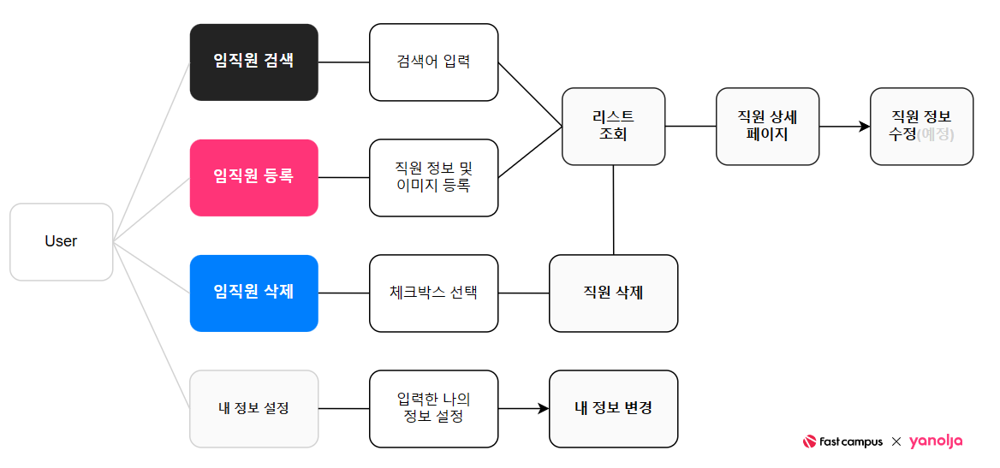

 

 
## 🏢 직원 관리 서비스 🏢

### 🔗 프로젝트 URL 

- **과제 URL** : [https://yeongmins-employee-management.web.app](https://yeongmins-employee-management.web.app/?#)

***

### 📌 필수 구현 사항

- [ ] “AWS S3 / Firebase 같은 서비스”를 이용하여 사진을 관리할 수 있는 페이지를 구현
- [ ] 스크롤이 가능한 형태의 리스팅 페이지를 개발
- [ ] 전체 페이지 데스크탑-모바일 반응형 페이지를 개발
- [ ] 사진을 등록, 수정, 삭제가 가능
- [ ] 유저 플로우를 제작하여 리드미에 추가
- [ ] css 상대수치 사용 
- [ ] JavaScript DOM event 조작

### 📌 선택 구현 사항

- [ ]  직원을 등록, 수정, 삭제가 가능
- [ ]  직원 검색 기능을 추가
- [ ]  JS가 꼭 필요한 부분에는 간단하기 구현

***

### 🗓️ 개발 기간

**2023.08.08 ~ 2023.08.18**

***

### 🔨 사용 기술 스택

 
 

  

***

### 🎨 구현 UI

**UI URL** : [Adobe XD](https://xd.adobe.com/view/9851eb3a-c1ea-4d8f-ba19-bdb2ebbecf17-cd02/)

***

### ✏️ userflow

***

### 📝 아쉬운점 & 느낀점

>   - 파이어베이스를 처음 사용했는데 연동이 너무 어려워서 DB 구현을 못했습니다.

### ⌨️ 추후 구현사항

>   - 파이어베이스 DB 연동
>
>   - 상세 프로필 구현
>
>   - 깔끔한 모바일 페이지 구현
