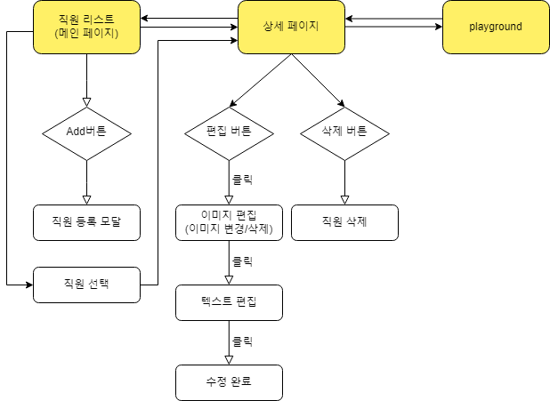

# 직원 사진 관리 서비스

배포 주소 : https://main--sweet-bublanina-45ac21.netlify.app/

## [개발 기간]

2023.08.09 ~ 2023.08.18

## [필수 요구사항]

- [x] “AWS S3 / Firebase 같은 서비스”를 이용하여 사진을 관리할 수 있는 페이지를 구현하세요.
- [x] 프로필 페이지를 개발하세요.
- [x] 스크롤이 가능한 형태의 리스팅 페이지를 개발하세요.
- [x] 전체 페이지 데스크탑-모바일 반응형 페이지를 개발하세요.
- [x] 사진을 등록, 수정, 삭제가 가능해야 합니다.
- [x] 유저 플로우를 제작하여 리드미에 추가하세요.
- [x] CSS 애니메이션 구현
- [x] 상대수치 사용(rem, em)
- [x] DOM event 조작

## [선택 요구사항]

- [x] 직원을 등록, 수정, 삭제가 가능하게 해보세요.

## [사용 스텍 및 구현 사항]

- 앞쪽에 언급된 필수 요구사항 및 선택 요구사항
- 파티클 애니메이션 (gsap, lodash 라이브러리 사용)
- 해쉬를 이용한 페이지 이동
- 모달을 활용한 깔끔한 화면 구성
- tailwindcss 활용한 css관리
- 반복적인 css 코드는 js로 구현

## [유저플로우]

## [회고]

- 디자인 스케치 및 유저 플로우를 먼저 작성하고 구현해서 방향과 개발 순서를 파악하는 데에 용이했다.
- 기능은 구현했어도 효율적인 코드인지 firebase 문법에 익숙하지 않아 확신이 들지 않았다.
- 데이터를 db 및 스토리지에 올리고, 받아오고, 수정하고, 삭제하는 플로우를 파악할 수 있었다.
- 디테일한 부분에서 생각보다 손이 많이 갔다.  
  : ex) 해쉬를 통해 페이지 이동 후 프로필 수정&새로고침 시에 계속 해쉬 주소에 맞는 화면으로 이동하는 것.
- 편집 기능을 구현할 때 어떤 메커니즘으로 사용자가 접하게 해야할 지에 대해 많은 고민을 했다.
- module로 분리하는 것, folder structure 관리 등이 쉽지 않았다. 이번 과제를 기회삼아 folder structure에 대해 깊이 있게 알아보고 다음 과제에 적용시켜 볼 예정이다.
- 다음에는 번들링하는 것을 시도해봐야겠다. (webpack, vite...)

## [업데이트할 사항]

- intersection observer 적용
- 검색 기능
