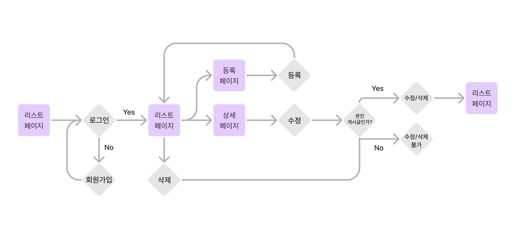
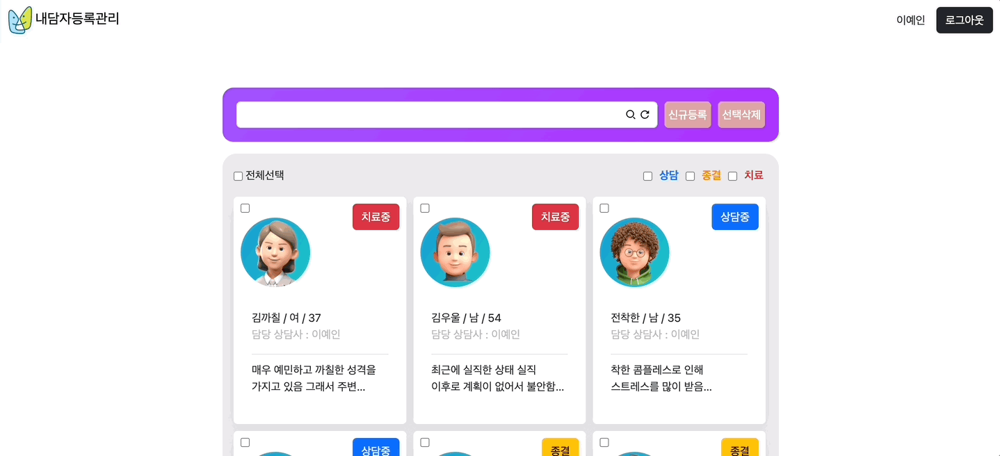
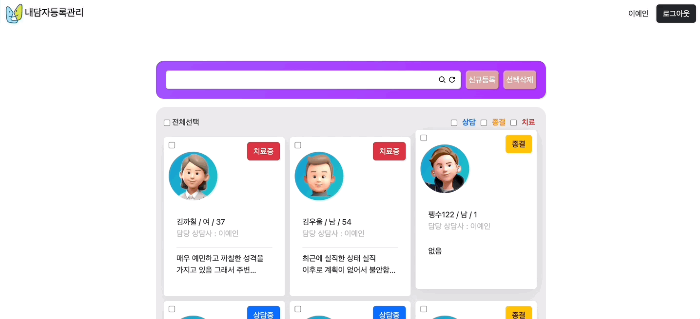

## 👩🏻‍⚕️👨🏼‍⚕️상담센터 내담자 등록관리 서비스

상담사가 본인 내담자의 프로필을 등록하고 모든 사용자가 내담자의 상담 진행상황을 볼 수 있는 서비스입니다

## 배포링크
https://profileapp-58ee0.web.app/

## 개발기간
2023.08.08~2023.08.17

## 유저플로우

## 주요기능

|                                                           1.  로딩 애니메이션                                                              |                                                         2.  회원가입/로그인                                                            |
| :--------------------------------------------------------------------------------------------------------------------------------------: | :---------------------------------------------------------------------------------------------------------------------------------: |
|  |   |

|                                                           3.  프로필 등록                                                              |                                                         4.  프로필 수정                                                            |
| :--------------------------------------------------------------------------------------------------------------------------------------: | :---------------------------------------------------------------------------------------------------------------------------------: |
|  |   |

|                                                           5.  프로필 삭제                                                              |                                                         6.  상담현황 필터링                                                            |
| :--------------------------------------------------------------------------------------------------------------------------------------: | :---------------------------------------------------------------------------------------------------------------------------------: |
|  |   |

## 필수요구사항
 - [x]  “AWS S3 / Firebase 같은 서비스”를 이용하여 사진을 관리할 수 있는 페이지를 구현하세요.
 - [x] 프로필 페이지를 개발하세요.
 - [x] 스크롤이 가능한 형태의 리스팅 페이지를 개발하세요.
 - [x] 전체 페이지 데스크탑-모바일 반응형 페이지를 개발하세요.
 - [x] 사진을 등록, 수정, 삭제가 가능해야 합니다.
 - [x] 유저 플로우를 제작하여 리드미에 추가하세요.
 - [x] CSS 애니메이션 구현
 - [x] CSS 상대수치 사용(rem, em)
 - [x] JS DOM event 조작

## 선택요구사항
 - [x]  사진 관리 페이지와 관련된 기타 기능도 고려해 보세요.
 - [x]  페이지가 보여지기 전에 로딩 애니메이션이 보이도록 만들어보세요.
 - [x] 직원을 등록, 수정, 삭제가 가능하게 해보세요.
 - [x] 직원 검색 기능을 추가해 보세요.
 - [ ] infinity scroll 기능을 추가해 보세요.
 - [ ] 사진을 편집할 수 있는 기능을 추가해 보세요.
 - [x] LocalStorage 사용

## 느낀점
- CRUD 앱을 간단하게 투두리스트 정도로 만들어봤었는데, 이미지 업로드/수정 및 생소한 firebase 사용으로 인해 난이도가 매우 높게 느껴졌습니다. 그래도 검색하면서 기능을 구현하고 마무리하면서 시간과 인터넷만 있다면 만들 수 있구나를 느꼈고 CRUD 의 핵심은 예외 처리와 사용자로써 검수하는 게 제일 중요하다고 느꼈습니다.

## 아쉬운 점
- 참고한 자료에 따라 Firebase 8버전을 사용함으로 JS ES6 최신문법을 사용하지 못한 점
- Firebase 에서 제공하는 문법이나 메소드를 이해하기보다 따라치기 바빴던 점
- Admin 계정은 자신이 등록하지 않은 모든 프로필의 삭제/수정을 가능하게 규칙을 짜고 싶었는데 적용하지 못한 점

