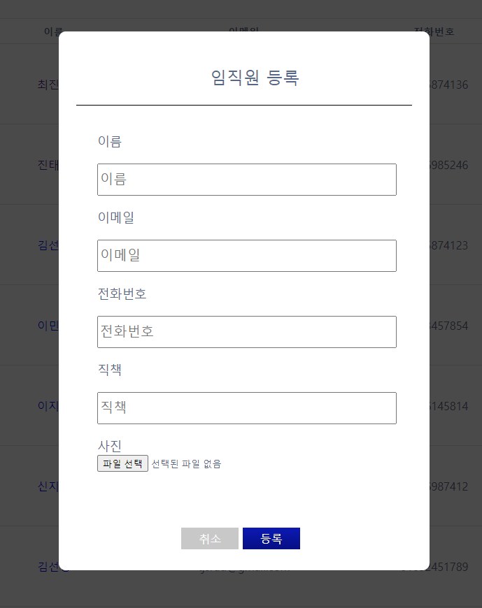

# :camera: 직원 정보 관리 서비스

패스트캠퍼스 X 야놀자: 프론트엔드 개발 부트캠프의 JAVASCRIPT 과제입니다.
직원들의 정보를 관리할 수 있는 서비스입니다.

주소 : https://employee-management-d1bad.web.app/

## [프로젝트 개요]

#### 프로젝트 기간

- 2023년 8월 8일 ~ 2023년 8월 18일
   

##### [필수 요구 사항]

- [x] “AWS S3 / Firebase 같은 서비스”를 이용하여 사진을 관리할 수 있는 페이지를 구현하세요.
- [x] 프로필 페이지를 개발하세요.
- [x] 스크롤이 가능한 형태의 리스팅 페이지를 개발하세요.
- [x] 전체 페이지 데스크탑-모바일 반응형 페이지를 개발하세요.
- [x] 사진을 등록, 수정, 삭제가 가능해야 합니다.
- [x] 유저 플로우를 제작하여 리드미에 추가하세요.

- [x] CSS
  - 애니메이션 구현
  - 상대수치 사용(rem, em)
- [x] JavaScript
  - DOM event 조작

   
   

## [화면]

#### 메인 화면

 

#### 프로필 화면

메인페이지의 이름 클릭 시 프로필 페이지로 이동.

## [주요 기능]

- ### CRUD
  | CREATE                                                                                                                                                       | READ                                                                                                                                                       |
  | ------------------------------------------------------------------------------------------------------------------------------------------------------------ | ---------------------------------------------------------------------------------------------------------------------------------------------------------- |
  | </img>  메인페이지의 등록 버튼 클릭 후 모달창에서 정보 등록 |       직원 정보 조회 |
  | **UPDATE** | **DELETE** |
  |   메인페이지 수정 버튼 클릭 후 수정|  수정 페이지의 삭제 버튼 클릭시 확인 경고창 생성 후 삭제|

 

- ### 데스크탑, 모바일 반응형 페이지

  | 메인 페이지                                                                                                              | 프로필 페이지                                                                                                             | 수정 페이지                                                                                                                   |
  | ------------------------------------------------------------------------------------------------------------------------ | ------------------------------------------------------------------------------------------------------------------------- | ----------------------------------------------------------------------------------------------------------------------------- |
  |  |  |  |

   

- ### CSS 애니메이션
  

임직원 등록 모달창 Fade-in 효과
 

## [흐름]
 

#### 유저플로우

## [개선사항]

- 수정 모달창을 이용한 수정 구현.
- 체크박스를 이용한 삭제 구현.
- 기타 선택 요구사항 구현.
