# ☘️ 예약 관리 시스템

## 📌프로젝트 개요

- 고객들의 예약 등록과 예약 관리를 도와주는 서비스 입니다.
- LocalStorage와 파이어베이스를 이용해 DB 정보를 이용합니다.

## 📂 사이트 주소

🔗 **배포 링크 :** https://kdt0-junghyoju-kakaoclone.netlify.app/

 
 

## 💿 필수 요구사항

- [x] “AWS S3 / Firebase 같은 서비스”를 이용하여 사진을 관리할 수 있는 페이지를 구현하세요.
- [x] 프로필 페이지를 개발하세요.
- [x] 스크롤이 가능한 형태의 리스팅 페이지를 개발하세요.
- [x] 전체 페이지 데스크탑-모바일 반응형 페이지를 개발하세요.
- [x] 사진을 등록, 수정, 삭제가 가능해야 합니다.
- [x] 유저 플로우를 제작하여 리드미에 추가하세요.
- [x] 애니메이션 구현
- [x] 상대수치 사용(rem, em)
- [x] DOM event 조작
       
       

## 📀 추가 구현사항

- [ ] 사진 관리 페이지와 관련된 기타 기능도 고려해 보세요.
- [x] 직원을 등록, 수정, 삭제가 가능하게 해보세요.
- [x] LocalStorage 사용
       
       

## 💻 화면 구성

|                            메인 페이지                            |                  사용자 등록(예약) 페이지                   |
| :---------------------------------------------------------------: | :---------------------------------------------------------: |
| 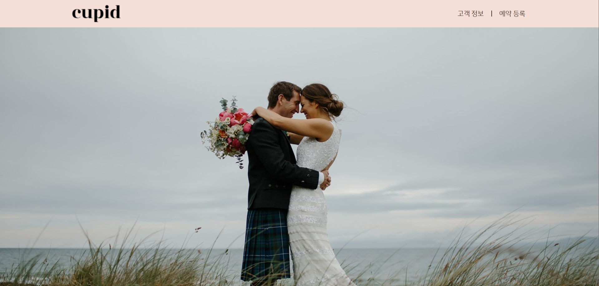 | 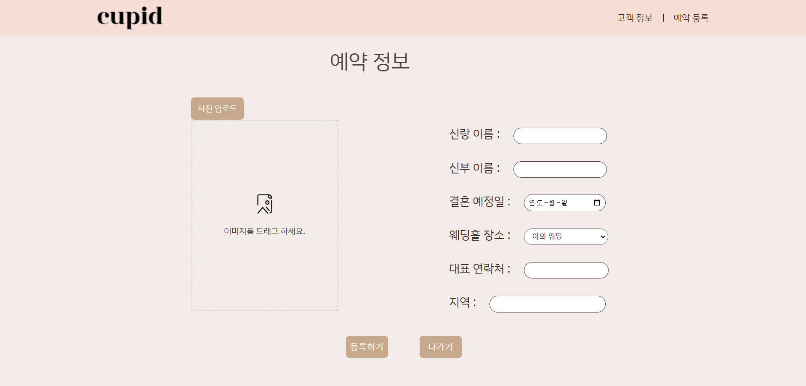 |

 

|                      고객 정보 관리 페이지                       |                         고객 프로필 페이지                          |
| :--------------------------------------------------------------: | :-----------------------------------------------------------------: |
| 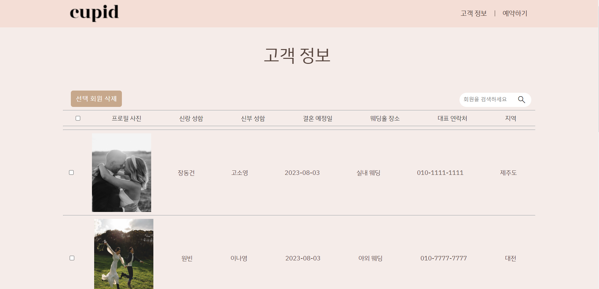 | 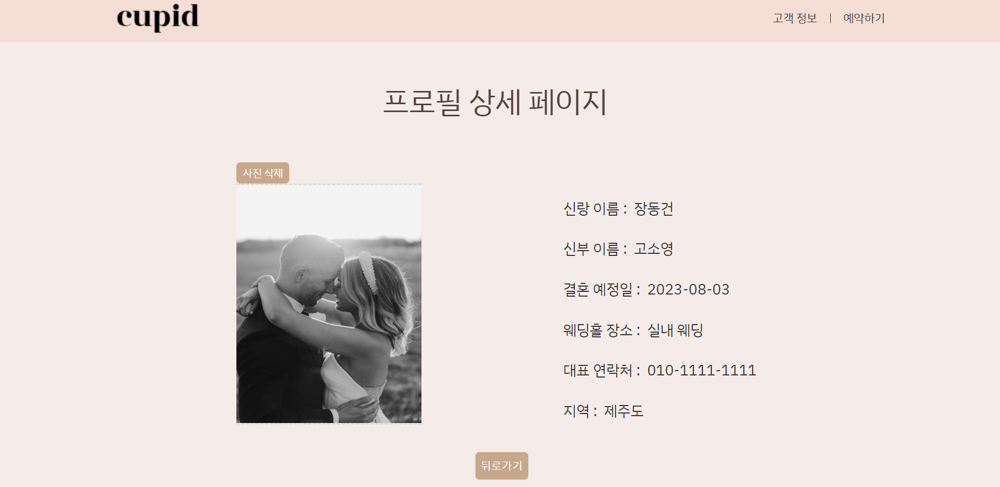 |

 

 

## 🔎 주요 기능

### 🔔 사용자 등록(예약) 페이지 - 사진 등록, 수정

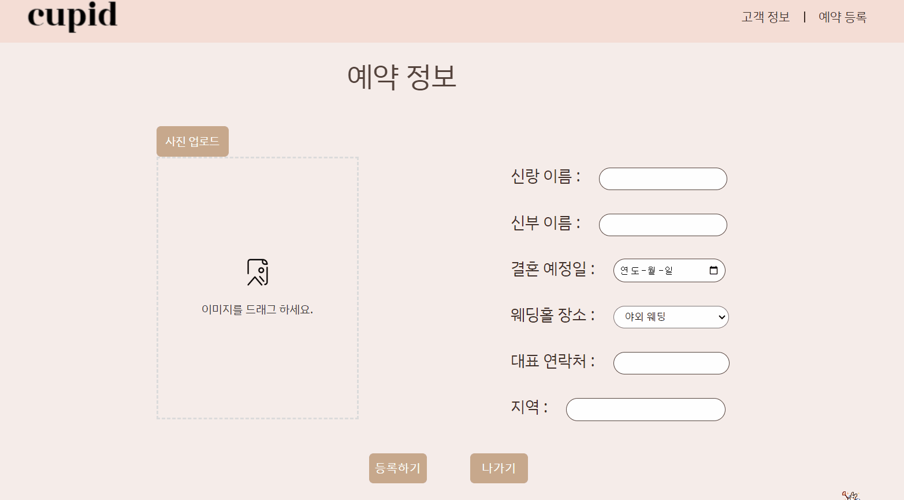

 

### 🔔 사용자 등록(예약) 페이지 - 사진 firebase 업로드

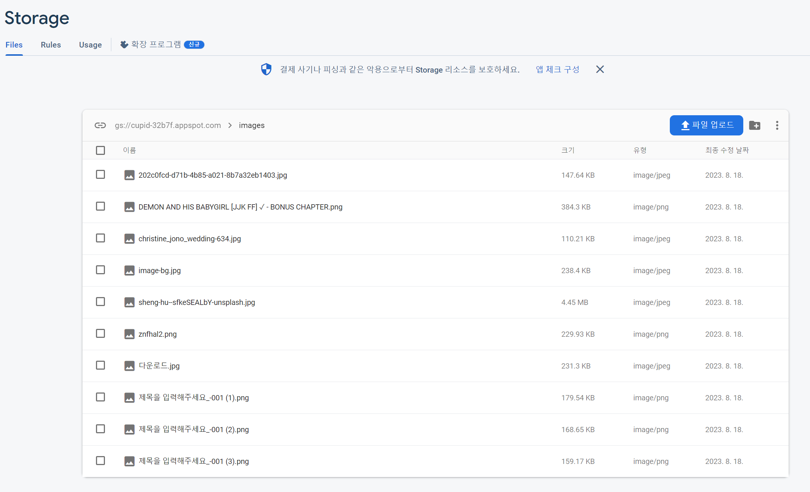

### 🔔 사용자 등록(예약) 페이지 - 사용자 정보 LocalStorage 업로드

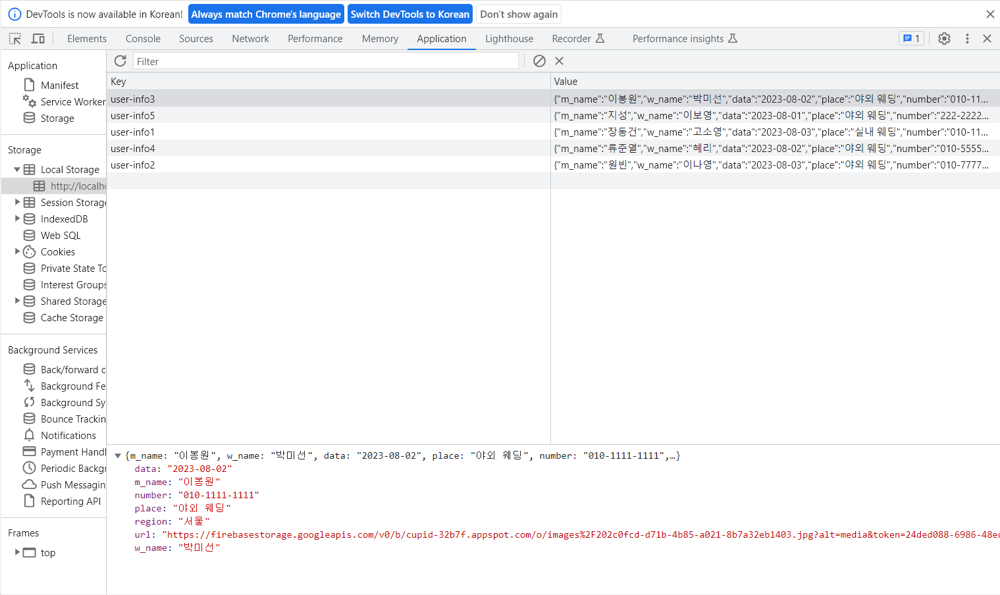

### 🔔 고객 정보 관리 페이지 - 스크롤이 가능한 형태의 리스팅 페이지

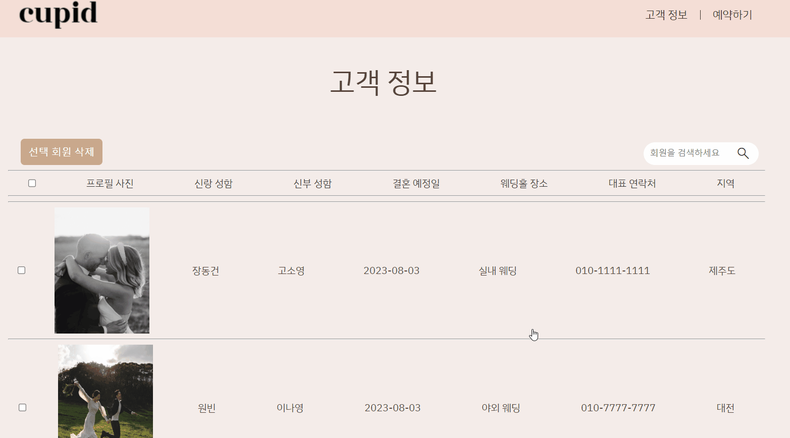

### 🔔 고객 정보 관리 페이지 - 애니메이션 구현

### 🔔 고객 프로필 페이지 - 사진 삭제

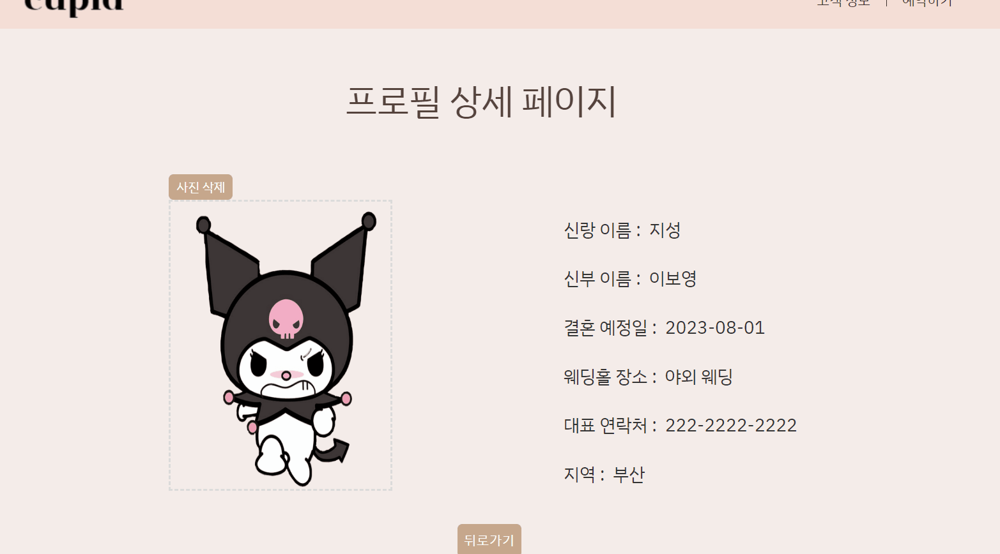

### 🔔 전체 페이지 데스크탑-모바일 반응형 페이지

|                                메인 페이지                                 |                         사용자 등록(예약) 페이지                          |
| :------------------------------------------------------------------------: | :-----------------------------------------------------------------------: |
|  | 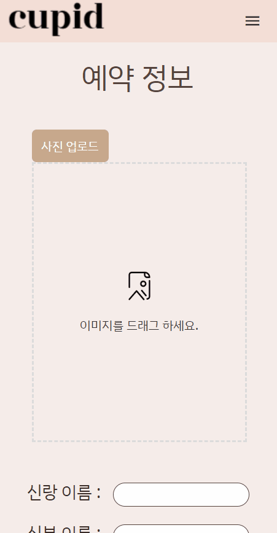 |

|                             고객 정보 관리 페이지                              |                            고객 프로필 페이지                            |
| :----------------------------------------------------------------------------: | :----------------------------------------------------------------------: |
| 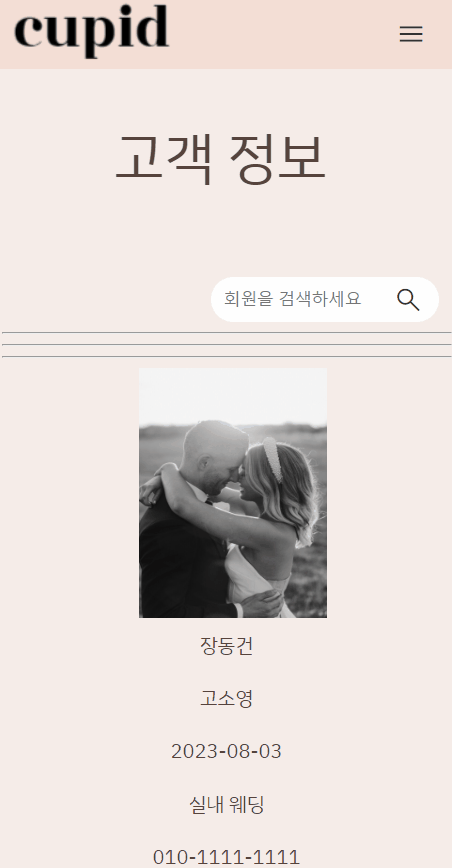 |  |
