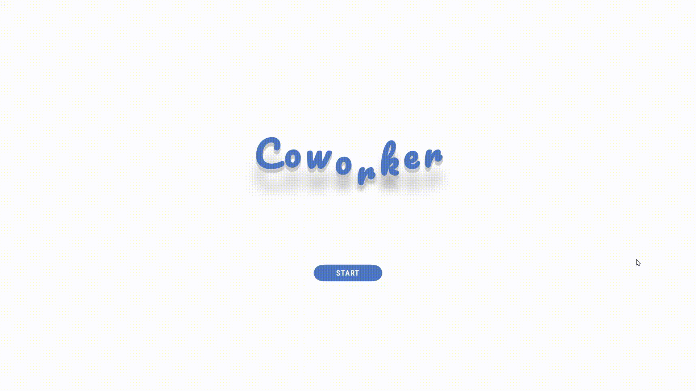
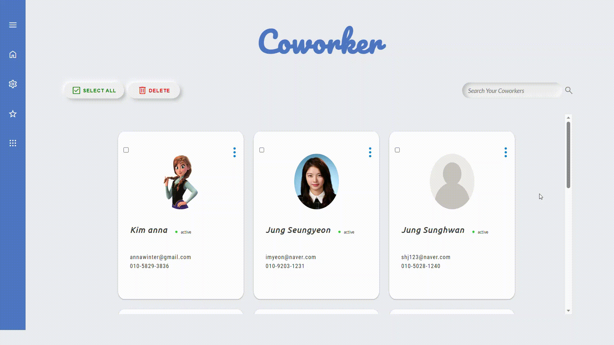
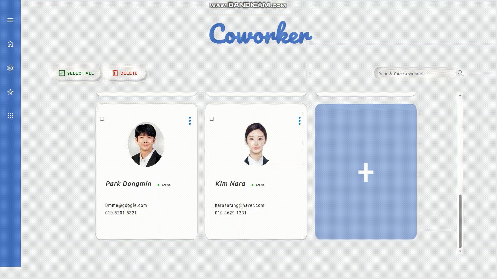
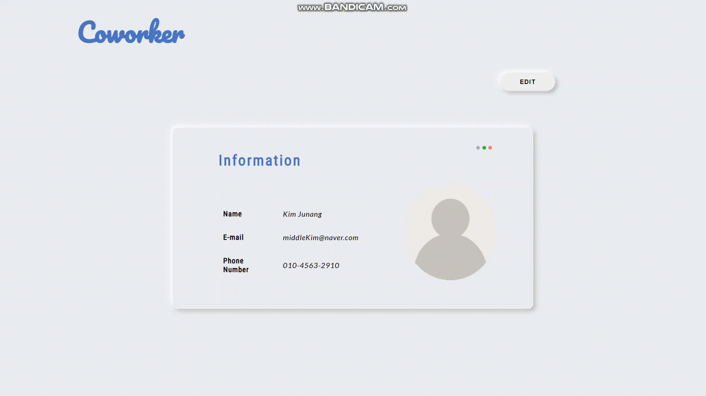
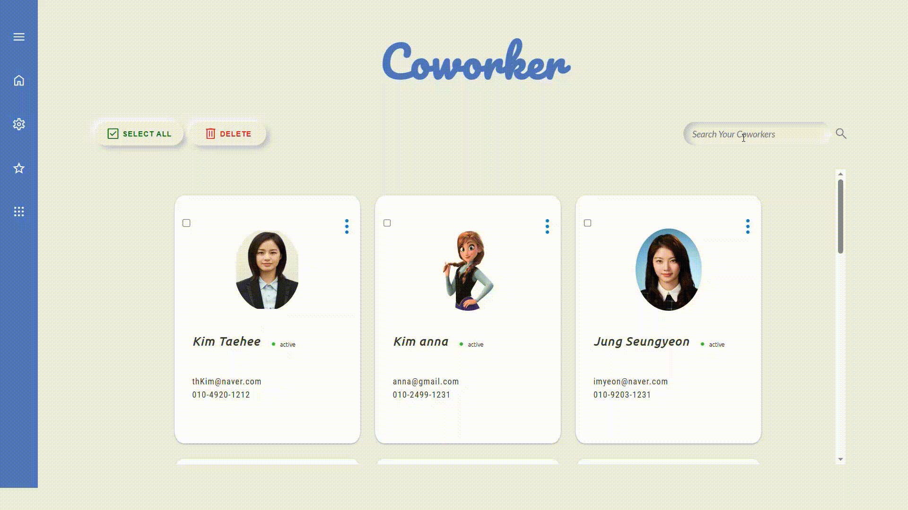
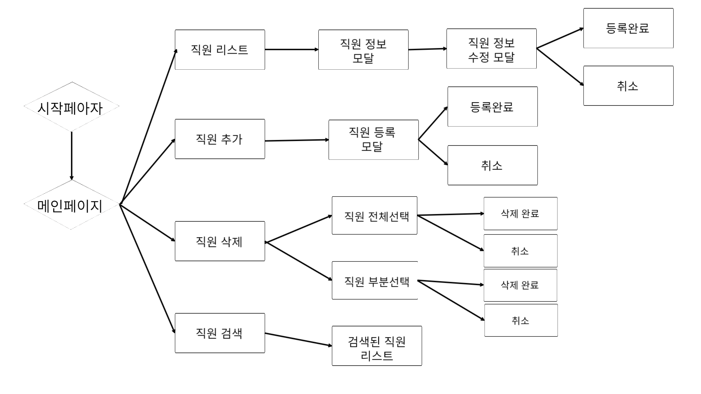

# :floppy_disk: 직원 사진 관리 서비스

직원 관리 서비스 
 
 
## :link: 사이트 주소
https://golden-truffle-afdadf.netlify.app/
 
 
## :ballot_box_with_check: 필수 요구사항
- [X] “AWS S3 / Firebase 같은 서비스”를 이용하여 사진을 관리할 수 있는 페이지를 구현하세요.
- [X] 프로필 페이지를 개발하세요.
- [X] 스크롤이 가능한 형태의 리스팅 페이지를 개발하세요.
- [X] 전체 페이지 데스크탑-모바일 반응형 페이지를 개발하세요.
- [X] 사진을 등록, 수정, 삭제가 가능해야 합니다.
- [X] 유저 플로우를 제작하여 리드미에 추가하세요.
- [X] 애니메이션 구현
- [X] 상대수치 사용(rem, em)
- [X] DOM event 조작
 
 

## :ballot_box_with_check: 선택 요구사항
- [ ] 사진 관리 페이지와 관련된 기타 기능도 고려해 보세요.
- [X] 페이지가 보여지기 전에 로딩 애니메이션이 보이도록 만들어보세요.
- [X] 직원을 등록, 수정, 삭제가 가능하게 해보세요.
- [X] 직원 검색 기능을 추가해 보세요.
- [ ] infinity scroll 기능을 추가해 보세요.
- [X] 사진을 편집할 수 있는 기능을 추가해 보세요.
- [X] LocalStorage 사용
 
 

## :key: 주요 기능

|시작화면|메인화면|
|:---:|:---:|
|||
|시작화면에 애니메이션 구현|메인 페이지 리스트 grid로 구현,  마우스를 올리면 그림자 효과 나타나게 구현|
 

|직원 추가|직원 수정|
|:---:|:---:|
|||
|직원 추가 페이지 구현|직원 수정 페이지 구현,  이미지 포함 직원 정보 모두 수정 가능|
 

|전체 선택|삭제|
|:---:|:---:|
|||
|선택 버튼 누르면 리스트 내 아이템 모두 선택,  한번 더 누르면 모두 선택 취소|선택된 아이템 삭제 구현,  파이어 베이스 내 이미지도 삭제|

 

|직원 검색|
|:---:|
||
|이름으로 검색하면 검색된 아이템들 화면에 표시|

 
 

## :walking: User Flow

 
 

## :eyes: 느낀점 및 추가할 점

직원 추가 페이지를 수정 페이지로 활용 함으로 재활용성을 높였다.
로컬에서는 직원을 추가하면 화면에 바로 적용이 되는데 netlify를 통해 배포한 사이트에서는 바로 적용이 되지 않는다. 이를 다음번에 해결해 봐야 겠다!

