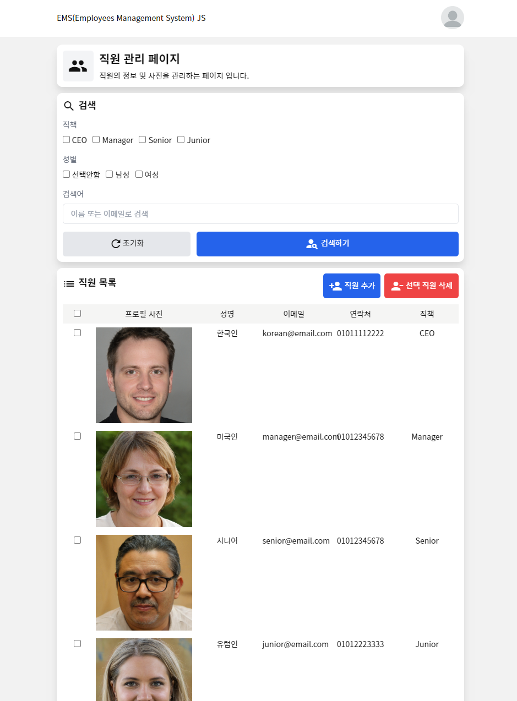
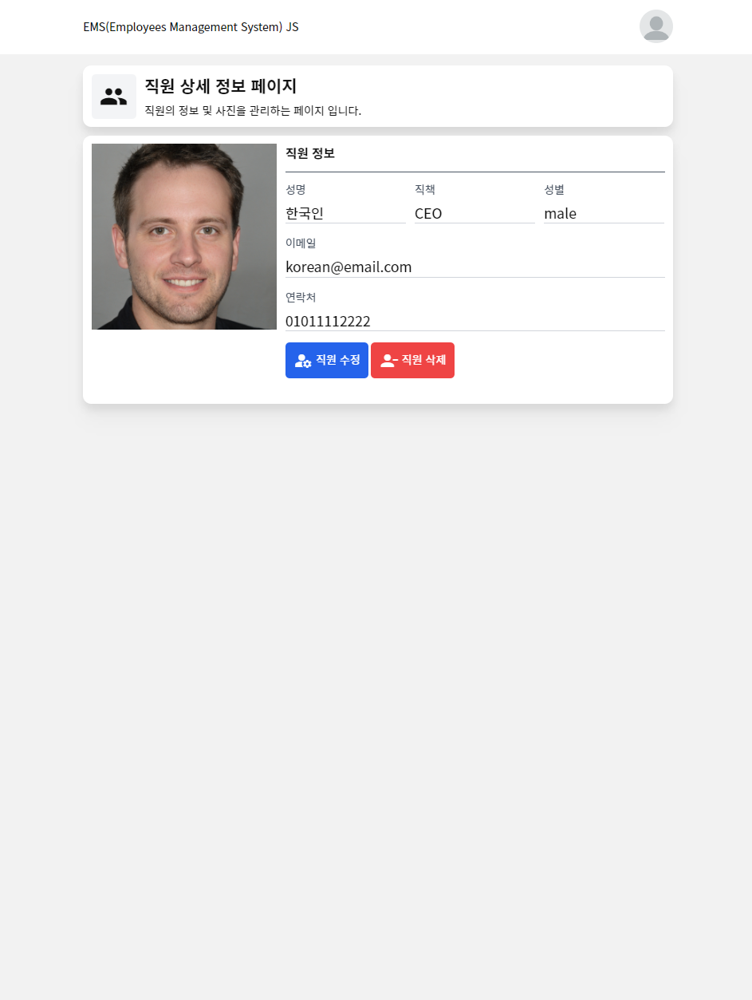
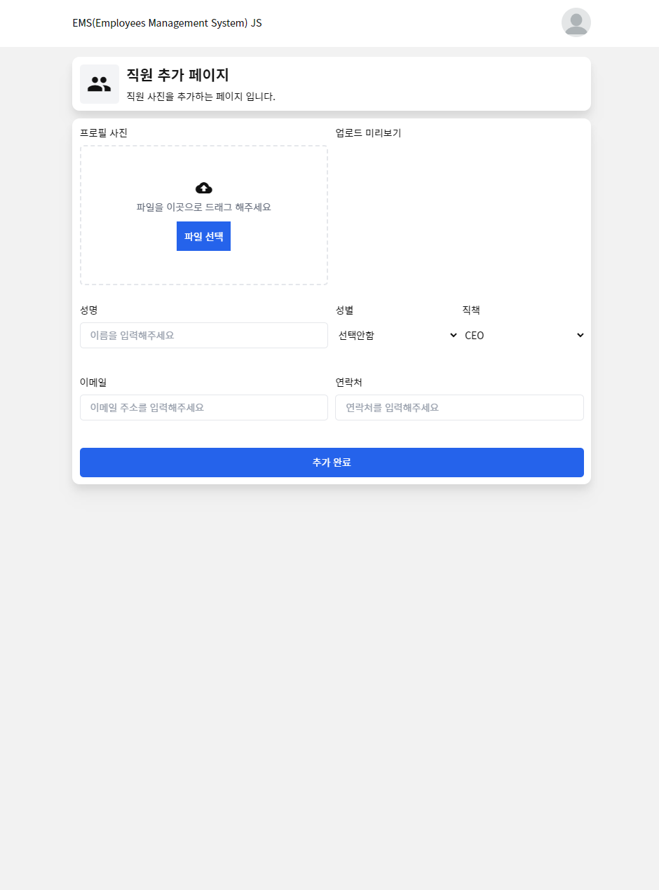
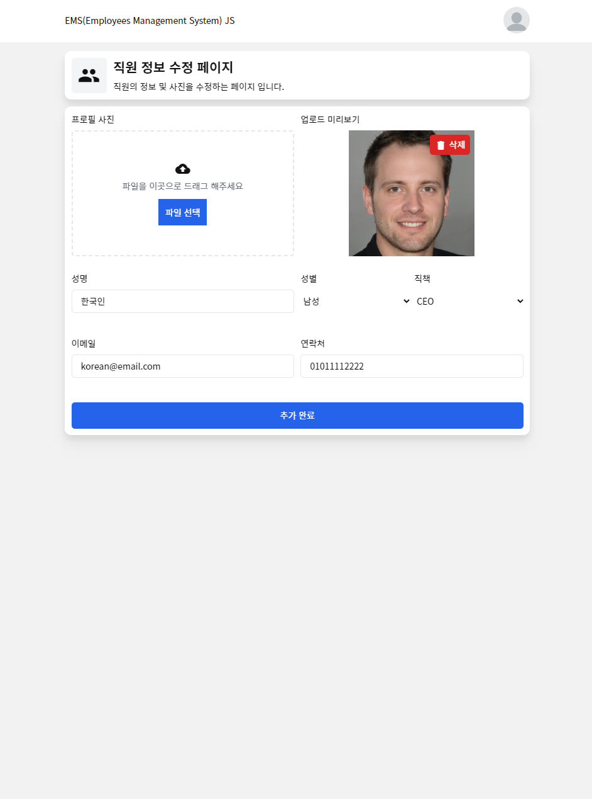
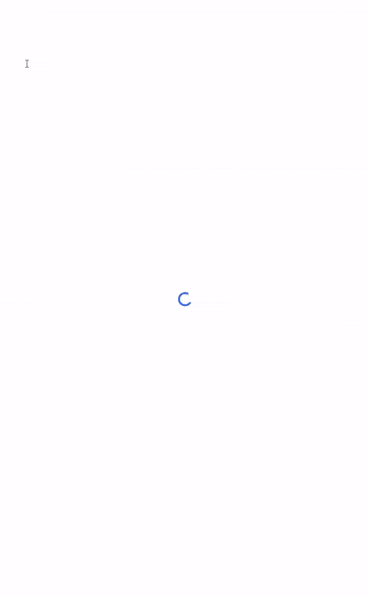
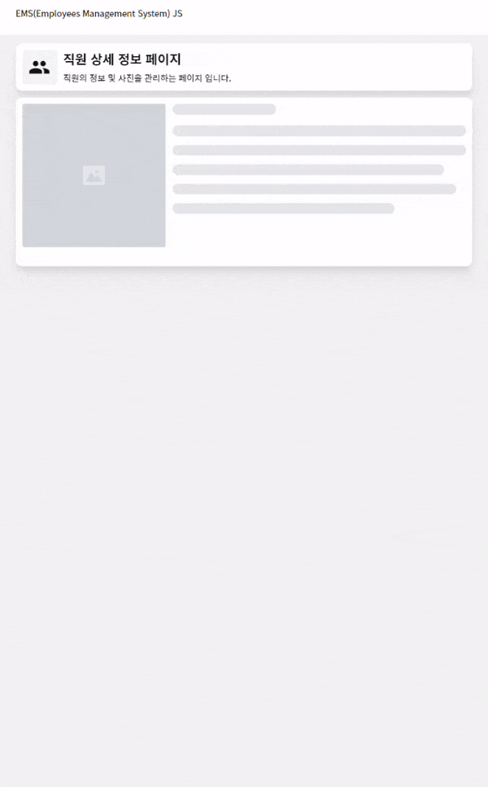
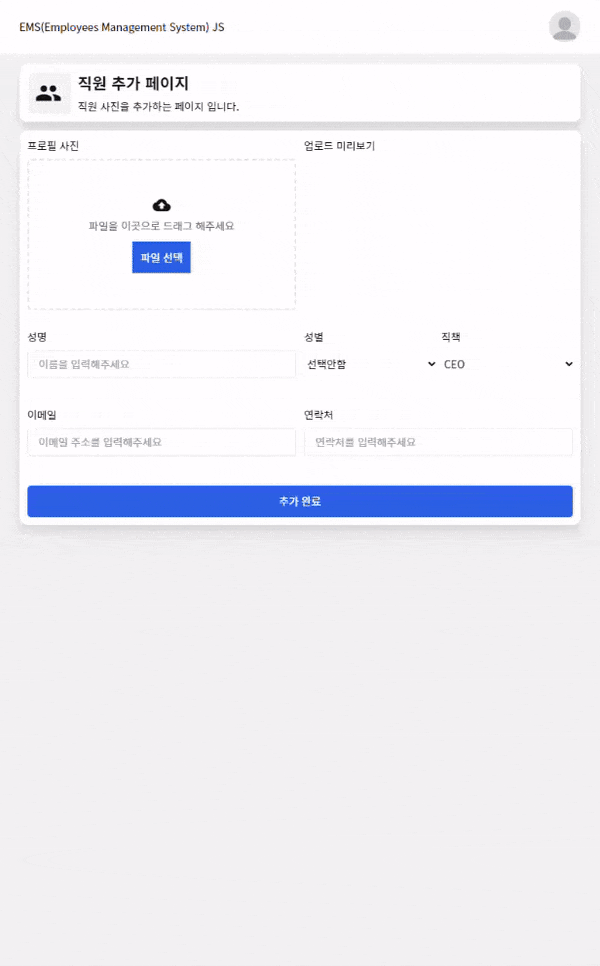
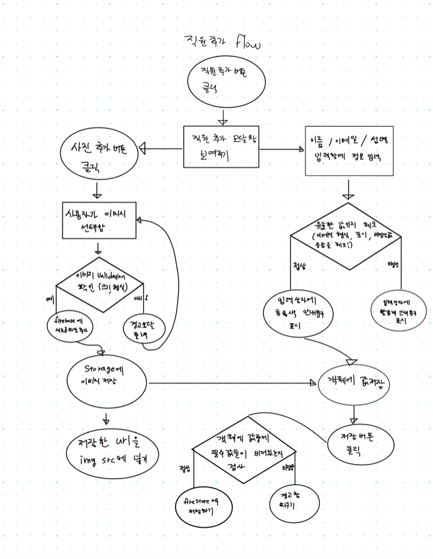
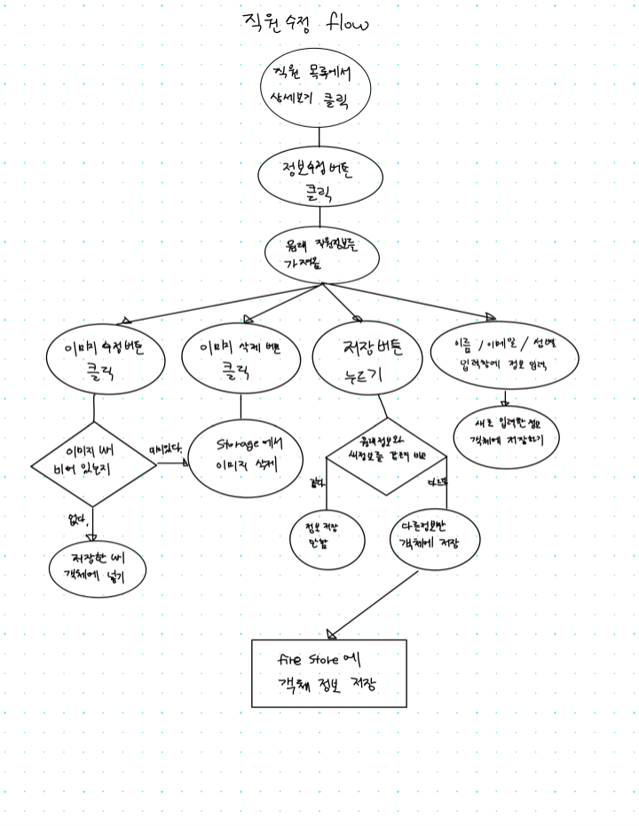

# KDT0_KimSeongKyeom

### 📷 직원 사진 관리 서비스

**배포 주소 [https://ems-photo-js.netlify.app/#/](https://ems-photo-js.netlify.app/#/)**

직원들의 정보와 사진을 관리(추가,수정,삭제)할 수 있는 DB 정보 관리 서비스 입니다.

### 💡 필수 강의에서 배운 `heropy.js`를 활용하여 제작 하였습니다.

**heropy.js**로 구현한 기능

- 싱글 페이지 어플리케이션 (SPA)
- 컴포넌트 (Component)
- 해시 라우터 (Hash Router)
- 스토어 (Store)

### 이미지 출처

> 프로필 이미지 출처 (ai 생성 이미지)  
> https://thispersondoesnotexist.com/

## 🎯 주요 구현 사항

1. 직원의 목록을 조회 하는 기능
   - 무한 스크롤 기능 (IntersectionObserver API)
   - 목록중 원하는 직원 선택해서 삭제 기능
   - 로딩 중 애니메이션
1. 직원 검색 기능 (직책, 성별, 검색어 옵션 사용가능)
1. 직원 추가 페이지
   - 이미지 에디터로 이미지 편집 기능
   - 폼 유효성 검사 (validation)
1. 직원 프로필 페이지
1. 직원 수정 페이지

## 프로젝트 상세 설명

### 개발 환경

   
 

### 사용 기술

   

### 무한 스크롤 기능 (IntersectionObserver API)

멤버를 검색 했을때 한 번에 모든 멤버를 불러오지 않고  
[IntersectionObserver API](https://developer.mozilla.org/ko/docs/Web/API/IntersectionObserver)를 사용해서 `footer` 요소에 스크롤이 이동했을때  
나머지 멤버들을 불러오는 무한 스크롤 기능을 구현했습니다.

### 직원 검색 기능

- 직원의 직책 / 성별 별로 검색하는 기능
- 입력한 키워드가 이메일인지 이름인지를 확인해서 키워드를 통해 검색하는 기능

### 프로필 사진 편집 기능

[TOAST UI Image Editor](https://ui.toast.com/tui-image-editor) 를 사용해서  
업로드한 이미지 위에 있는 수정 버튼을 누르면  
사이즈 조절, 크롭 등의 편집 기능을 사용할 수 있습니다.  
(하단 구현 이미지 참고)

### 로딩시 애니메이션 추가

첫 화면에서 html,css,js, 이미지 등의 asset을 불러올때  
무언가를 로딩중이라는 것을 사용자에게 알려주기 위해서  
원이 **돌아가는 애니메이션**을 추가하였습니다.

그리고 상세 프로필 페이지에 접속했을때는  
이미지와 텍스트를 로딩하기 전이라면  
**skeleton**을 사용해서 로딩중인 공간을 미리 보여주고  
완료되면 **skeleton**이 사라지게 구현을 했습니다.

## 🖥️ 화면 구현

- 메인 페이지
- 프로필 페이지
- 직원 추가 페이지
- 직원 수정 페이지

### 페이지 구현 이미지

|             **메인 페이지**              |             **프로필 페이지**             |
| :--------------------------------------: | :---------------------------------------: |
|  |  |

|             **직원추가 페이지**             |             **직원수정 페이지**             |
| :-----------------------------------------: | :-----------------------------------------: |
|  |  |

### 로딩 및 기능 구현 이미지

|               첫 화면 로딩               |                프로필 페이지 로딩                 |                프로필 사진 편집                 |
| :--------------------------------------: | :-----------------------------------------------: | :---------------------------------------------: |
|  |  |  |

## ➡️ 유저 흐름(flow) 이미지

## 😊 과제를 통해 배운 점

이번과제를 통해서 배운점이 정말 정말 많았지만, 주요하게 생각나는 점만 짧게 기술 해보겠습니다.

### 컴포넌트 개념에 대해 실습

비슷한 기능을 가지고 있는 요소를 컴포넌트로 묶어서 재사용 가능하고,  
관리하기 쉽게 만들수 있는 장점을 실습을 통해 알게 되었습니다.

또한 `props`를 부모요소에서 전달해서 정보를 전달받고 사용하면서  
재사용성의 중요성과 전역에서 사용가능한 `store`를 생성하여  
store가 변경 될때 마다 리렌더링이 되게 하는 기능을 구현하면서  
javascript를 활용하는데 있어 **더 시야를 트이게 하는 계기**가 된것같습니다.

### IntersectionObserver 사용법

기존에는 `window`에 `scroll` 이벤트를 통해서 요소를 보고 있는지를 확인 하면서  
스크롤 인터렉션 이나 무한스크롤 기능을 구현 했었습니다.

스크롤 위치를 얻고 그 위치를 대상 요소와 비교하는 방법은  
생각보다 귀찮고 어려운 작업이였습니다.

이번 과제를 통해서 스크롤 위치를 구할 필요 없이  
IntersectionObserver를 사용해서 편리하고 정확하게  
원하는 요소에만 보고 있는지 확인 가능한점이 매우 좋았습니다.

앞으로도 자주 사용하면 좋을것같다는 생각이 든 기능이였습니다.

### async / await 를 사용

서버리스로 DB, 스토리지 서비스를 제공하는 firebase를 사용하면서  
비동기로 데이터를 주고 받기 위해서 async / await 를 실습하게 되었습니다.

콜백 지옥, promise.then... 을 사용하면서 발생할 수 있는 promise 지옥에서 벗어날 수 있었으며  
가독성이 좋아지고 좀 더 데이터의 흐름을 이해하기 쉬운 코드로 바꿀 수 있는  
장점이 많아진다는 점을 과제 실습을 통해서 실제로 체감 하게 되었습니다.

## 😢 아쉬운 점 + 고치고 싶은 점

**효율적인 이벤트 리스너 사용방법 연구 필요**  
직원추가, 직원 삭제, 검색 등등 기능을 구현하려다 보니  
정말 많은 수의 요소에 이벤트 리스너를 추가하게 되었습니다.

하지만 언제 추가한 이벤트 리스너를 제거 해야 할지를 감을 잡지 못해서  
계속해서 이벤트를 추가만 하고 삭제하지를 않았습니다.  
이 점은 리팩토링해서 개선하고 싶습니다.

**비효율적인 쿼리 사용**  
firebase에서 멤버들의 정보를 가져올때 `where`, `and`, `or`, .... 등의 쿼리를 작성하였습니다.  
공식 문서를 참고하여 쿼리를 작성하였으나, 아직 실력이 부족한 탓인지  
효율적이지 못하고 if와 else를 통해서 조건에 따라 쿼리를 만들다 보니  
달라지는 4개의 상황에 따라 4개의 쿼리를 통해 구현하게 되었습니다.

좀 더 공식문서를 연구해서 이 점도 리팩토링을 통해 개선을 해보고 싶습니다.
