# ⚽ 나만의 맨유 선수단 관리 서비스 ⚽

## [배포] :  https://jinjongsufastcampus.web.app/index.html
***

## [사용스택]

***
## [구현 사항]
* “AWS S3 / Firebase 같은 서비스”를 이용하여 사진을 관리할 수 있는 페이지를 구현하세요.  ✅
* 프로필 페이지를 개발하세요. ✅
* 스크롤이 가능한 형태의 리스팅 페이지를 개발하세요. ✅
* 전체 페이지 데스크탑-모바일 반응형 페이지를 개발하세요. ✅
* 사진을 등록, 수정, 삭제가 가능해야 합니다. ✅
* 유저 플로우를 제작하여 리드미에 추가하세요. ✅
* CSS
  * 애니메이션 구현 (모든 페이지 fadein 효과 적용) ✅
  * 상대수치 사용(rem 사용) ✅
* JavaScript
  * DOM event 조작 ✅
* 직원을 등록, 수정, 삭제가 가능하게 해보세요. ✅
* 직원 검색 기능을 추가해 보세요 ✅
* LocalStorage 사용 ✅
***
## [화면 예시]
### <b>1. 메인페이지 </b>
시작하기 버튼 hover  색상 변함 & 커지는 효과 적용

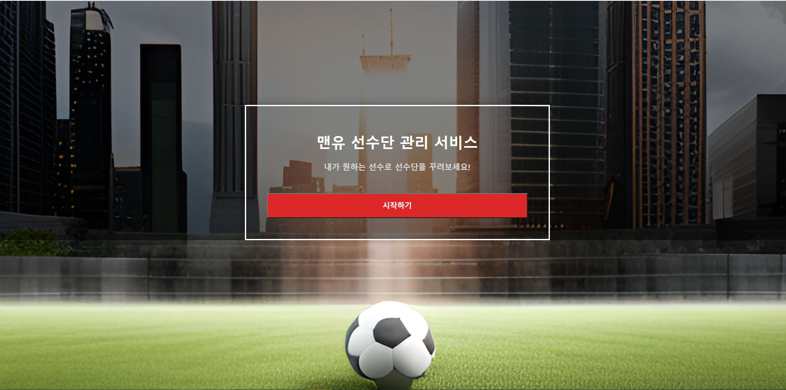
### <b>2. 선수 리스트 페이지</b> 
검색 기능 구현 & 전체 선택 및 해제 구현

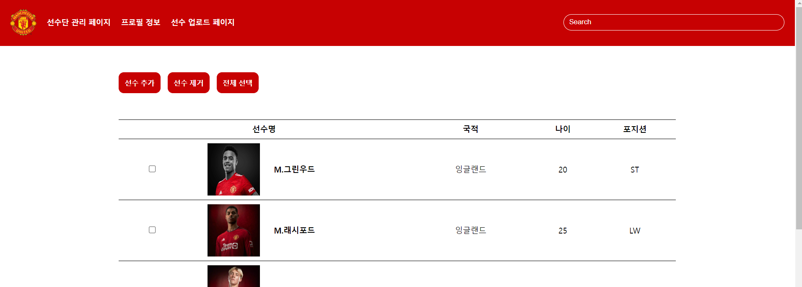

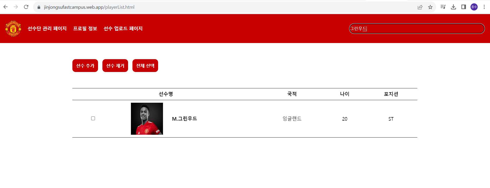

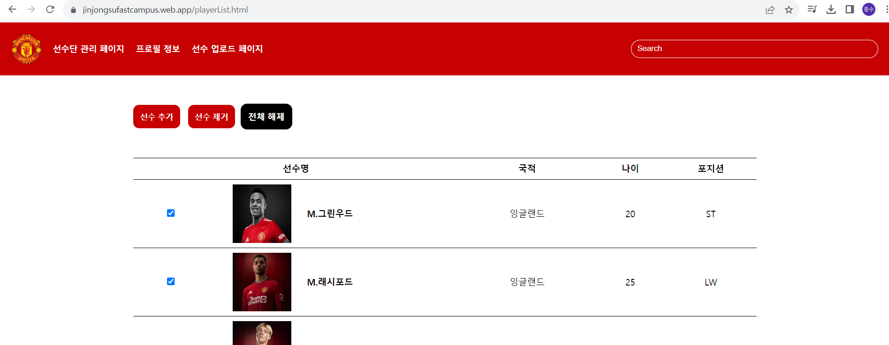

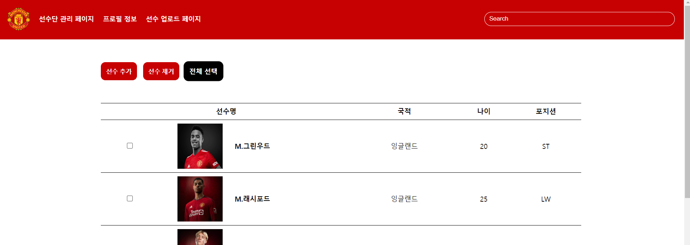
### <b>3. 선수 추가 페이지</b> 
업로드 기능 구현  
트랜스퍼마켓 검색 버튼 구현

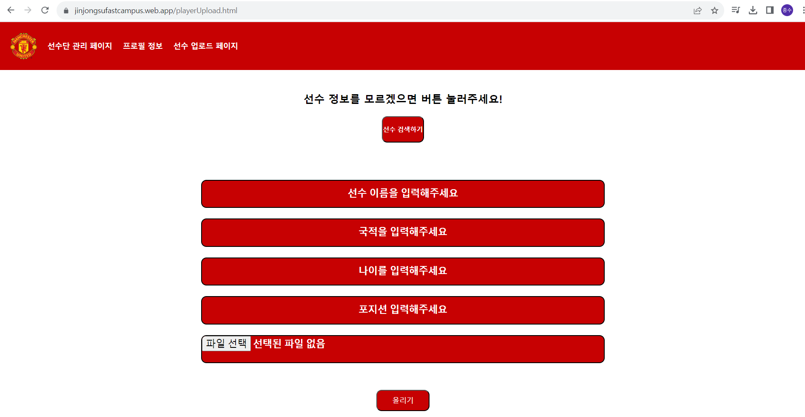

### <b>4. 선수 프로필 페이지</b>
선수 프로필 불러오기  
정보 변경 모달 기능 구현(LocalStorage 이용)

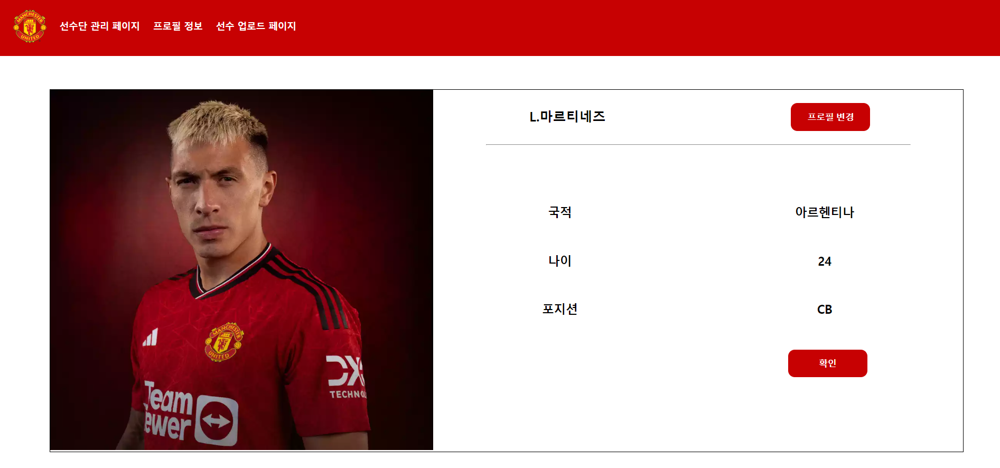

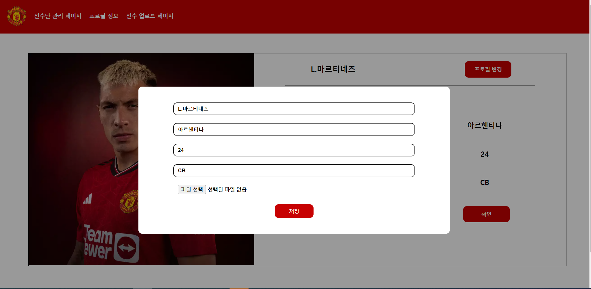

### <b>5. 반응형 페이지</b>
검색 및 선수 추가,제거,선택 버튼 위치 변경  
프로필 페이지 배치 변경  
모바일 및 태블릿 반응형 웹 구현 완료

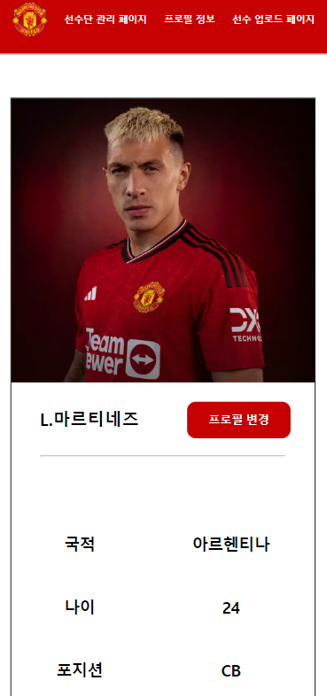

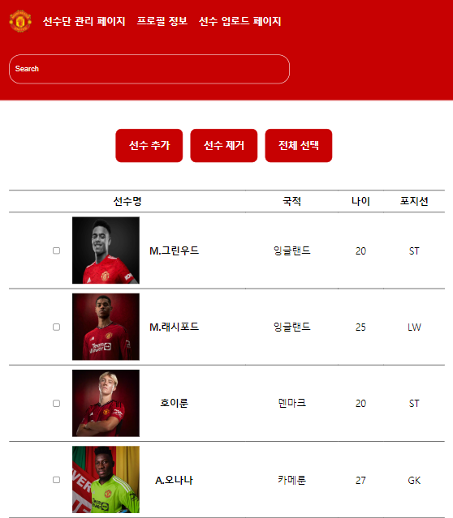

### <b> 6. 유저 플로우 </b>

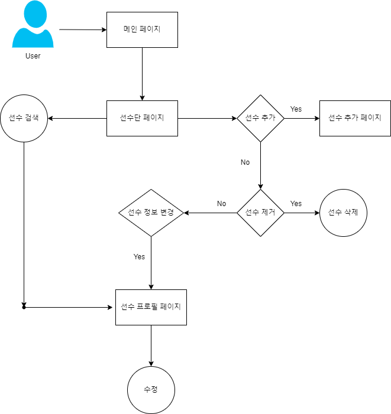
