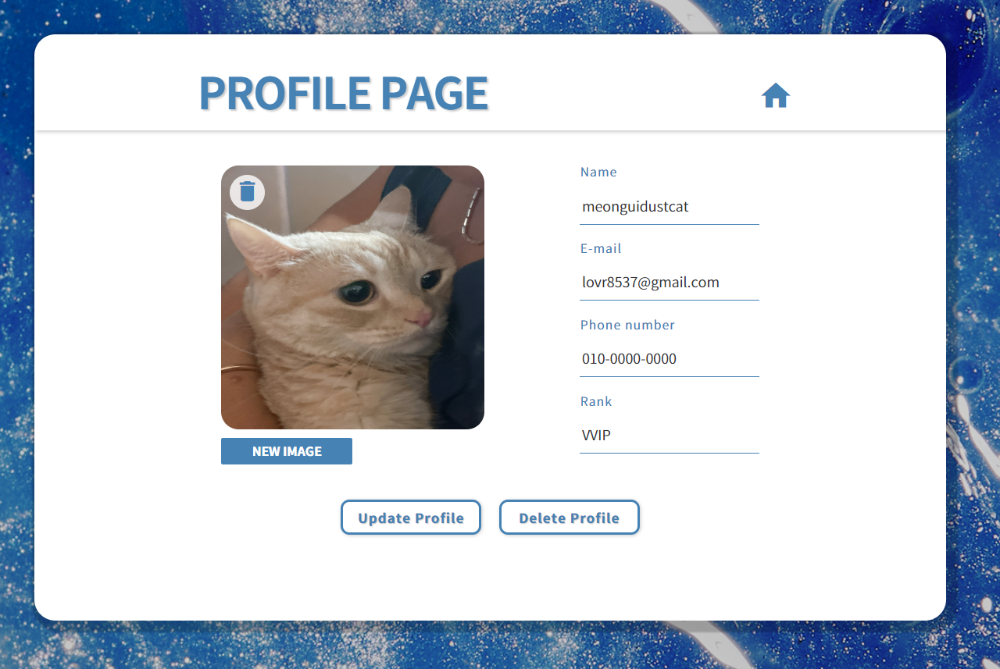

# KDT0_ParkEunYeong 직원 사진 관리 서비스

직원들의 사진을 관리할 수 있는 사진 관리자 서비스

2023-08-08 ~ 2023-08-18


## [배포 링크]


## [used Jquery to Solve for EventLisner Error]

js에서 일부 `addeventlistener`가 작동하지 않아 Jquery를 사용한  부분이 있습니다.

Jquery 없이 해결은 가능했지만 아래와 같이 가독성이 떨어져 일부 사용했습니다.
```js
//에러 발생 코드
const addBtn = document.querySelector('#add-btn');
addBtn.addEventListener('click', () => {
  window.location.href = "./upload.html"
});

//해결된 코드 (window.onload, if()사용)
window.onload = function(){
  const addBtn = document.querySelector('#add-btn');
    if(addBtn) {
  addBtn.addEventListener('click', () => {
    window.location.href = "./upload.html"
  })
 }
};
```

## [Page Info]
- Main Page
- Upload Page
- Profile Page

* Main Page
  등록 된 staff의 profile row를 클릭해서 Profile Page로 이동 할 수 있습니다.
  화면의 사이즈가 작아지면 리스트 내부에서 스크롤이 가능합니다.
  가로 스크롤의 경우 드래그로 가능합니다.
  `REGISTER` 버튼으로 새로운 staff를 등록할 수 있는 Upload Page로 이동합니다.

* Upload Page
 - 사진과 인적사항을 기입하고 `SAVE`버튼으로 저장 후 Main Page으로  이동합니다.
  -이름은 최초 작성 후에 수정이 안되니 주의해주세요.

 - 우측 위의 `HOME`아이콘을 눌러 Main Page로 이동합니다.

* Profile Page
  - 이미지 삭제 및 수정
  이미지 위의 `trash can` 아이콘을 눌러 이미지를 삭제가 가능하고, `NEW IMAGE` 버튼으로 새로운 사진 업로드가 가능합니다.

  - 인적사항 수정 후 프로필 저장
  오른쪽의  인적사항 내용을 눌러 수정하고, `Update Profile` 버튼을 눌러 수정한 사항을 저장합니다.

  - 프로필 삭제
  `Delete Profile` 버튼을 눌러 프로필 전체를 삭제 합니다.


  -우측 위의 `HOME`아이콘을 눌러 Main Page로 이동합니다.


## [Page preview]

- Main Page

- Upload Page

- Profile Page


