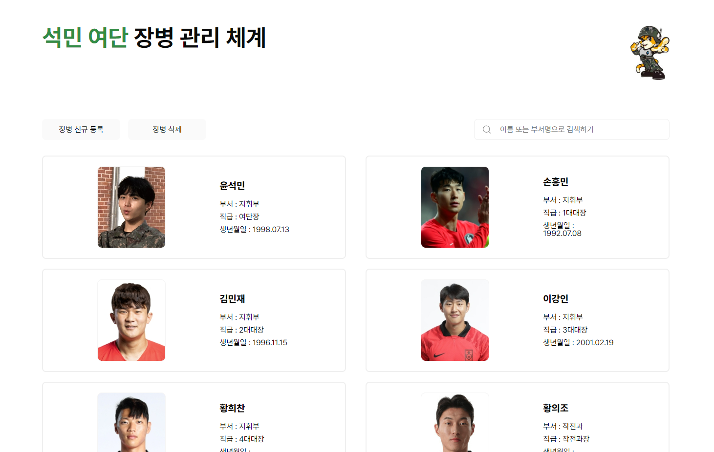

# 여단 장병 관리 체계

배포 주소 : https://stirring-madeleine-e0c831.netlify.app/

## [구현 내용]
- Firebase firestore를 통해 db를 구축하고 storage를 통해 이미지 업로드
- 스크롤이 가능한 형태의 리스팅 페이지
- 화면 크기별로 html의 font-size를 변경하여 rem을 통해 속성의 크기를 지정하였고, 요소들의 배치를 조정함 
- 프로필은 장병 wrapper를 hover할 경우 크게 보이며, 애니메이션을 통해 수정하기 버튼을 보이게 함.
- 신규 등록, 삭제, 수정 기능을 추가함

## [리팩토링 예정 부분]
- database에 user정보를 저장할 때, 처음 등록한 timestamp를 기록하고 이를 통해 오래된 순 부터 화면에 보여지게 정렬했었다. 하지만 이 방법보다는 db에 pk 값을 설정하면 삭제나 등록 등을 진행할 때 index와 관련된 로직을 더욱 쉽게 만들 수 있을 것 같다.
- 검색 기능은 시간이 부족해서 진행하지 못했다. 주로 검색은 백엔드 api에 의존했었어서 직접 구현해보고 싶다.
- 무한 스크롤 기능이 페이지네이션보다 사용성이 좋다고 하여 이것 또한 리팩토링 시간이 충분히 주어지면 구현할 예정이다.

## [화면 예시]

## [User Flow]
