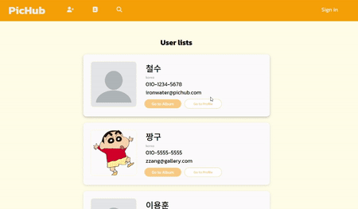
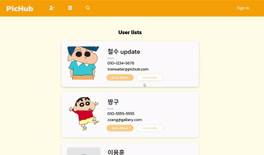
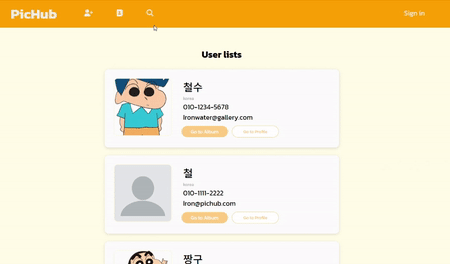
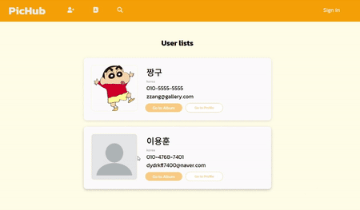
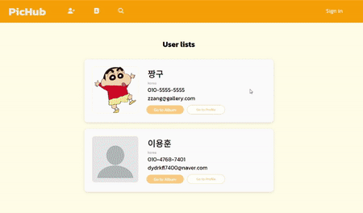
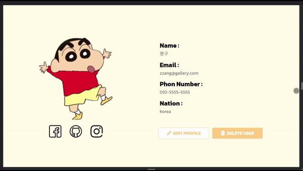

# 📷 사진 관리 서비스
### ✏️ 설명
#### 간단한 정보와 사진을 관리할 수 있는 웹 서비스입니다.
### 💡 중점사항
#### 이 프로젝트는 AWS s3의 _"사용"_ 과 _"학습"_ 에 중점을 두었습니다. 유저와의 상호작용을 통하여 s3 버킷의 폴더 및 데이터가 _"유기적"_ 으로 바뀌고, s3 버킷의 폴더와 데이터 구성에 따라서 홈페이지의 화면 구성 또한 _"유기적"_ 으로 바뀌도록 하였습니다.

## 데모 링크
<a href="https://loquacious-pika-5c69cc.netlify.app/" target="_blank">
  
</a>

## 

## 구현 내용


> ## 🔧 기능 및 구성

### 1. 유저 생성
#### 프로필 사진을 등록하고(안 하면 기본 사진) 간단한 정보를 입력 후 유저를 생성합니다.


```
💡 유저를 생성하면 AWS s3 버킷에 유저의 고유한 id 값을 이름으로 한 폴더가 생성되고, s3 버킷 안에 전체 유저의 데이터가 담겨 있는 json 파일을 가져온 후 유저를 업데이트, 저장합니다.
```
### 2. 프로필 정보 변경
#### 유저의 정보나 프로필 이미지를 변경합니다.



```
💡 유저의 정보는 s3 버킷 안에 json 파일을 가져와 업데이트합니다. 또한 프로필 사진은 유저가 생성될 때 만들어진 유저의 고유한 id 값을 이름으로 가진 s3 버킷 안 폴더의 첫번째 경로에 저장이 됩니다. 만약 기존의 프로필 사진을 다른 사진으로 변경하면 s3 버킷의 폴더의 첫번째 경로에 저장된 기존 프로필 사진 데이터가 삭제되고 새로운 사진으로 교체되도록 코드를 작성하였습니다.
```
### 3. 유저 삭제
#### 등록된 유저를 삭제합니다.



```
💡 s3 버킷 안에 json 파일을 가져와 해당 유저를 삭제한 후 업데이트합니다. 또한 유저가 생성될 때 만들어진 s3 버킷 안에 고유한 id 값을 가진 폴더도 같이 삭제됩니다.
```
### 4. 유저 검색
#### 등록된 유저를 이름으로 검색합니다. (다른 검색 기능은 이후 추가 예정)



```
💡 s3 버킷 안에 json 파일을 가져와 유저의 이름에 검색어가 포함되면 화면에 출력해 줍니다.
```
### 5. 앨범 생성 및 삭제
#### 자신이 관리하고 싶은 이미지를 넣을 앨범을 생성하고 삭제할 수 있습니다.



```
💡 s3 버킷 안에 해당 유저의 고유한 id 값을 가진 폴더의 첫번째 경로에 생성하고자 하는 이름을 가진 폴더를 생성합니다. 앨범을 삭제하면 고유한 id 값을 가진 폴더의 첫번째 경로에 생성되었던 앨범을 삭제합니다. 
```
### 6. 앨범 커버 이미지 변경
#### 생성한 앨범의 커버 이미지를 변경합니다.


```
💡 앨범의 커버 이미지는 생성될 때 기본 이미지로 생성이 되고, 앨범 내부의 이미지를 추가하면 앨범의 커버 이미지가 앨범 내부 첫 이미지로 변경이 됩니다.
```
### 7. 이미지 추가 및 삭제
#### 앨범 내부에 이미지를 업로드하고 삭제합니다.



```
💡 앨범 내부에 이미지를 추가 및 삭제할 수 있습니다. 이미지를 추가하면 s3 버킷 내부 해당 유저의 고유한 id 가진 폴더를 찾고, 그 폴더 내부에 해당 앨범을 찾은 후 그 앨범 폴더 내부에 이미지 데이터를 저장합니다. (이미지는 박스안에 드래그하면 미리보기가 생성된 후 Add 버튼을 누르면 추가, Cancel 버튼을 누르면 취소됩니다.)
```
### 8. 로딩
#### 앨범 내부 이미지가 로딩될 때 로딩 화면이 나옵니다.

<video src="./assets/gif/로딩화면.mp4" autoplay loop muted></video>

```
💡 시간이 걸리는 출력에 로딩 화면이 나옵니다. (로딩이 빠르면 거의 안 보이기 때문에 위 예시에는 일부러 setTimeout을 통하여 강제로 나오게 하였습니다.)
```

> ## 📂 AWS s3 버킷 데이터 저장 구조
#### 3명의 유저가 있다는 가정하에 대략적인 버킷의 데이터 저장 구조입니다.
```
s3 bucket
  ├─user1 id 폴더
  │       user1프로필사진.jpg
  │
  │       album1 - 이미지들 저장
  │       album2 - 이미지들 저장
  │      
  ├─user2 id 폴더
  │       user2프로필사진.jpg
  │
  │       album1 - 이미지들 저장
  │       album2 - 이미지들 저장
  │
  └─user3 id 폴더
          user2프로필사진.jpg
          
          album1 - 이미지들 저장
          album2 - 이미지들 저장
```
> ## 🪄 반응형 구조
#### 370px 의 넓이까지는 원활하게 사용할 수 있도록 만들었습니다.
| 헤더 및 유저 리스트 | 프로필 및 프로필 변경 |
|:---------:|:---------:|
|   |    |
| 앨범 및 이미지 | |
|  | |

## 사용 스택
     

## 추가하고 싶은 기능
```
1. 로그인 기능 (인증된 유저로 자신의 데이터만 조작 가능하도록)
2. 좋아요(저장) 기능
3. 사진 편집(필터) 기능
4. 많은 사진 데이터가 들어옴에 따른 페이지 네이션 or 무한 스크롤 기능
5. 검색 기능 다양화
```
## 아쉬운 점
```
단순히 요즘 많이 사용하고 빠르다는 이유로 vite.js를 사용해 봤는데 이러한 단순한 이유보다는 정확한 이유와 장점을 공부하고 사용해야 할 것 같습니다.
```
## 유저 플로우

