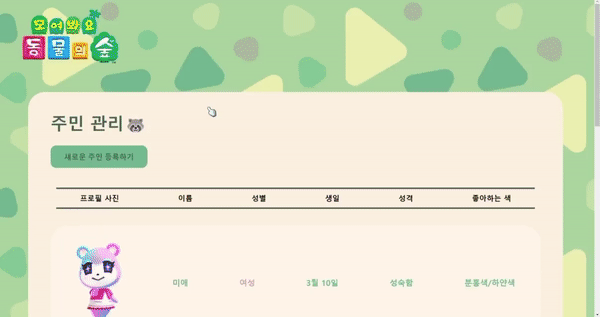

# 🦝 주민 관리 서비스

모여봐요 동물의 숲에 등장하는 주민들의 사진과 정보를 관리하는 서비스입니다 :>
기본적인 CRUD 기능을 제공합니다.

## [배포 사이트]

https://villagers-list.web.app/

## [과제 기간]

2023.08.07 ~ 2023.08.17

## [필수 요구사항]

- [x] “AWS S3 / Firebase 같은 서비스”를 이용하여 사진을 관리할 수 있는 페이지를 구현하세요.
- [x] 프로필 페이지를 개발하세요.
- [x] 스크롤이 가능한 형태의 리스팅 페이지를 개발하세요.
- [x] 전체 페이지 데스크탑-모바일 반응형 페이지를 개발하세요.
- [x] 사진을 등록, 수정, 삭제가 가능해야 합니다.
- [x] 유저 플로우를 제작하여 리드미에 추가하세요.

* CSS
  - [x] 애니메이션 구현
  - [x] 상대수치 사용(rem, em)
* JavaScript
  - [x] DOM event 조작

## [선택 요구사항]

- [ ] 사진 관리 페이지와 관련된 기타 기능도 고려해 보세요.
- [x] 페이지가 보여지기 전에 로딩 애니메이션이 보이도록 만들어보세요.
- [x] 직원을 등록, 수정, 삭제가 가능하게 해보세요.
- [ ] 직원 검색 기능을 추가해 보세요.
- [x] infinity scroll 기능을 추가해 보세요.
- [ ] 사진을 편집할 수 있는 기능을 추가해 보세요.
- [ ] LocalStorage 사용

## [기술 스택]

 

## [구현 중 버그 관련]

💡사용자 입장에서 사이트를 이용해보며 발생할 수 있는 버그를 최소한으로 하기 위해 노력했습니다.

 

- **주민 정보 수정 시**

  - 정보를 입력하고 ‘수정 완료’ 버튼을 누르지 않은 채 로고를 통해 메인페이지로 돌아가면 정보가 변하지 않은 원래 상태로 있도록 했습니다.

     

  - 사진을 변경하지 않고 ‘수정 완료’ 버튼을 눌렀을 때 url이 변경되어 사진이 깨졌는데, boolean 변수를 통해 이를 막아놓았습니다.

   

  - 사용자가 정보를 하나라도 입력하지 않았을 때 alert 창으로 경고를 주도록 했습니다.

 

- **새로운 주민 등록 시**

  - 사진이나 정보들 중 하나라도 사용자가 입력을 하지 않은 채로 ‘등록하기’ 버튼을 누르면 alert 창으로 사용자에게 경고해줍니다.

 

- **데이터 id 관련**
  - 각 데이터의 ID는 영어이름으로 저장이 되는데, 직원 관리 페이지처럼 '사람'을 관리하는 것이 아니고 각 캐릭터에 대한 정보를 관리하는 것이기 때문에 영어 이름이 같을 수 없다고 생각해 영어 이름을 PK라고 생각을 해서 ID로 설정했습니다.

## [화면 예시]

### 메인 페이지

 

### 메인 페이지- 주민이 한 명도 없을 때

 

### 주민 등록 페이지

 

### 상세 정보 페이지

 

### 상세 정보 페이지 - 수정 모드

 

## [User Flow]

## [아쉬운 점]

- 로딩 애니메이션을 주민 상세 페이지에서 이미지를 불러올 때만 사용했는데, 메인 페이지 등에서 스켈레톤 ui를 적용해보지 못한 점이 아쉽습니다.
   

- 검색 기능을 구현하지 못한 점이 아쉽습니다.
