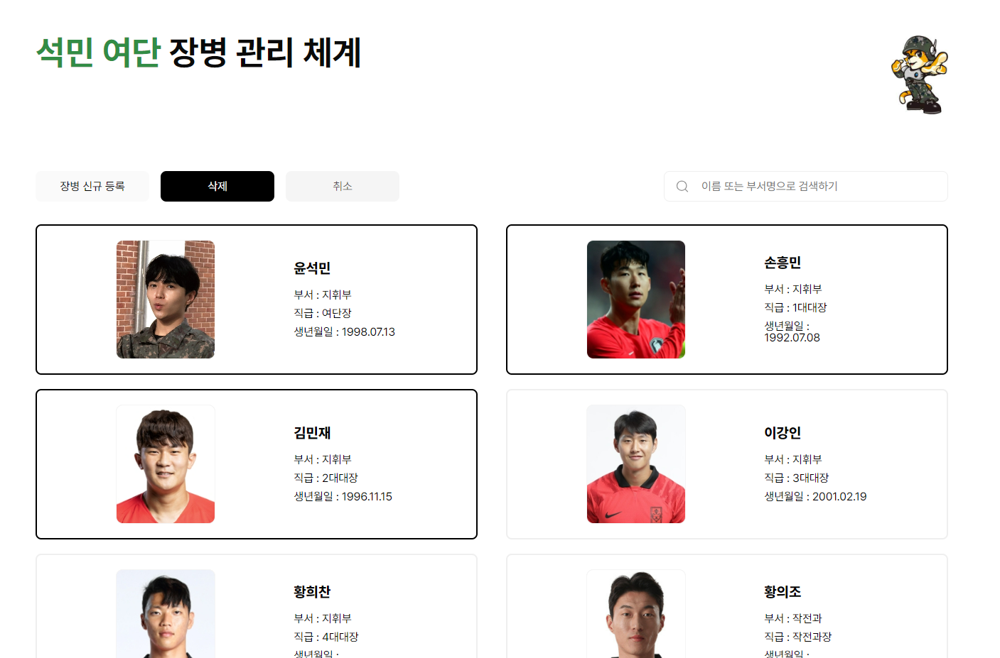
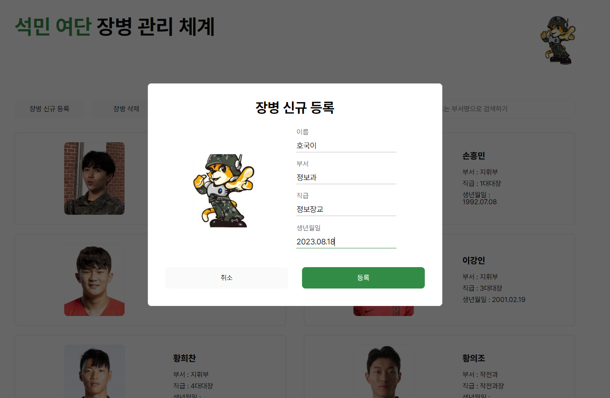

# 🌴 동물의 숲 주민 관리 서비스 🐾

동물의 숲 주민들의 사진을 관리할 수 있는 서비스를 만들어 보았습니다.
 

## [배포 링크]

https://animal-crossing-project.web.app/animal.html
 

## [과제에 구현한 요구사항]

- `Firebase 서비스`를 이용하여 사진을 관리할 수 있는 페이지를 구현.
- 프로필 페이지 개발.
- 스크롤이 가능한 형태의 리스팅 페이지를 개발.
- 전체 페이지 데스크탑-모바일 반응형 페이지를 개발. (주민 목록은 w: 750px까지만 구현)
- 사진 등록, 수정, 삭제 가능.
- 유저 플로우를 제작하여 리드미에 추가.
- 사진 관리 페이지와 관련된 기타 기능: 동숲 주민 카드 뒤집기 게임
- 직원 등록, 수정, 삭제 가능.

* CSS
  - 애니메이션 구현 -> animal.css에 카드 흔들기
  - 상대수치 사용(%)
* JavaScript
  - DOM event 조작
     

## [화면 예시]

### 주민 관리 페이지

  
주민 목록을 확인할 수 있다.  
등록하기(upload) 페이지로 이동할 수 있으며, 주민 정보 수정, 삭제가 가능하다.

### 업로드 페이지

    등록하기 페이지로 주민 정보를 입력하고 등록할 수 있다.

### 수정 페이지

  
주민 정보를 수정할 수 있다. 사진도 변경할 수 있으며 저장 버튼을 누르면 주민 정보가 반영되고 X버튼을 누르면 취소할 수 있다.

### 게임 페이지

   동숲 주민 카드 뒤집기 게임으로 클릭해서 짝 맞추기 게임을 즐길 수 있다.

## [유저플로우]

  
상단바의 주민 관리를 누르면 주민 관리 페이지로 이동할 수 있다.  
미니 게임을 누르면 동숲 카드 뒤집기 게임 페이지로 이동할 수 있다.

## 주민 등록하는 방법

상단바의 게임모양 아이콘을 누르면 동숲 백과 사이트로 이동한다.  

 
원하는 주민을 선택해서 정보를 등록하면 된다! 

## 기술 스택

